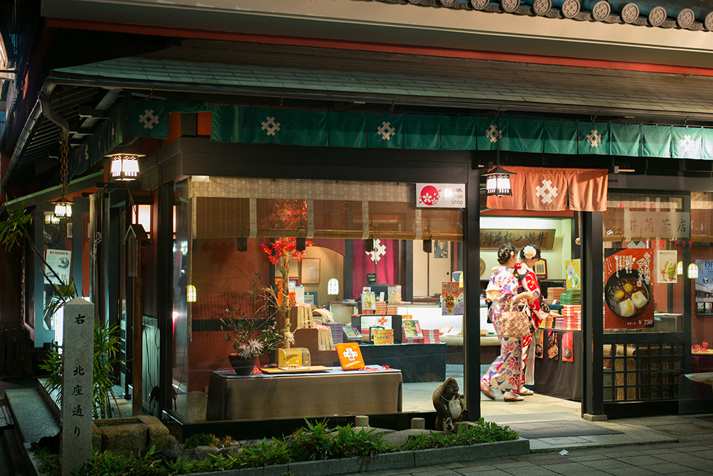
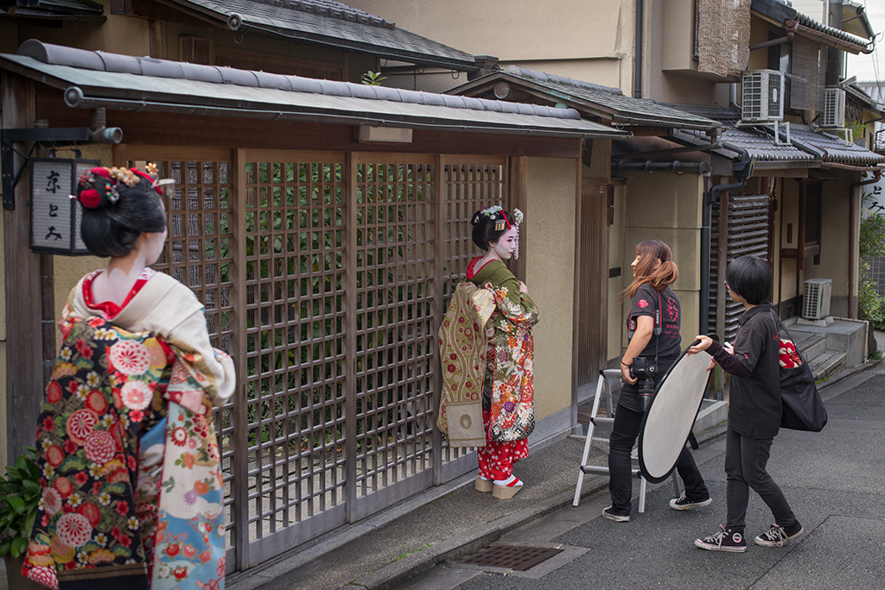
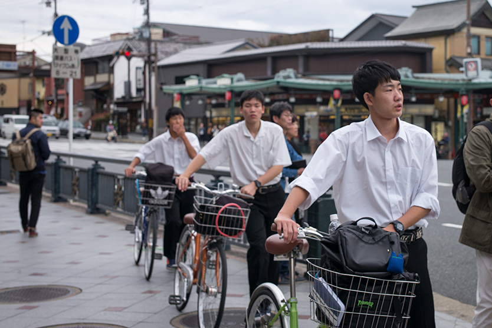
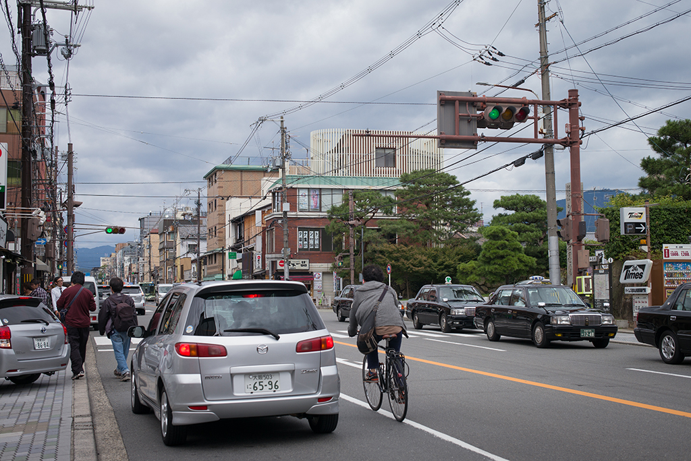
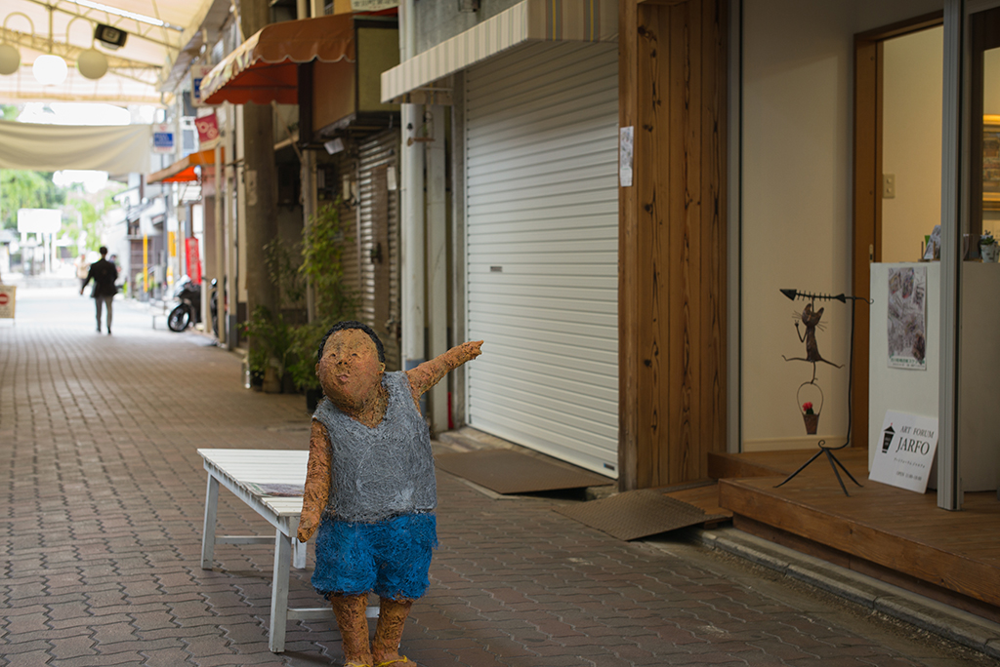
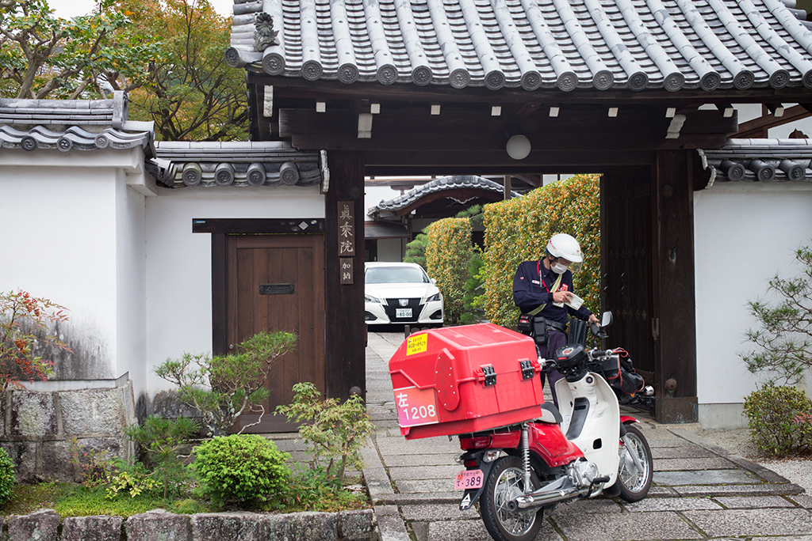
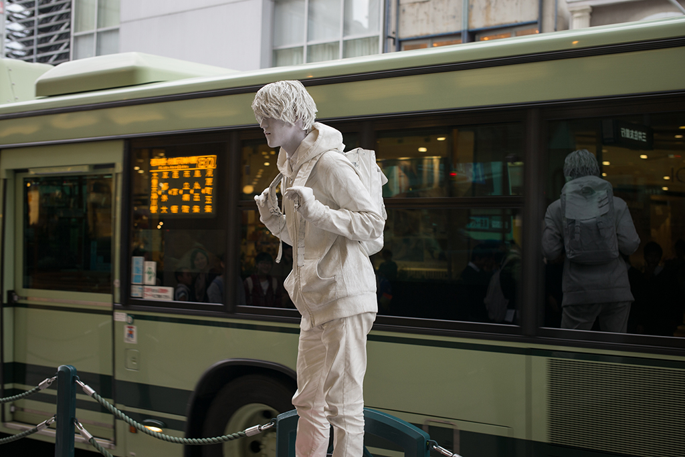
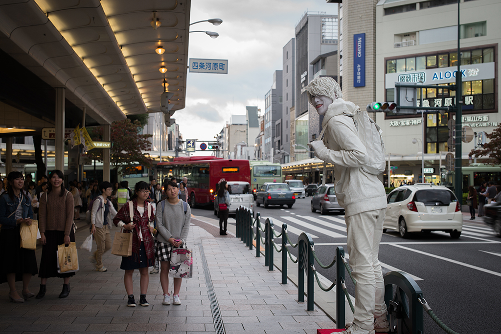
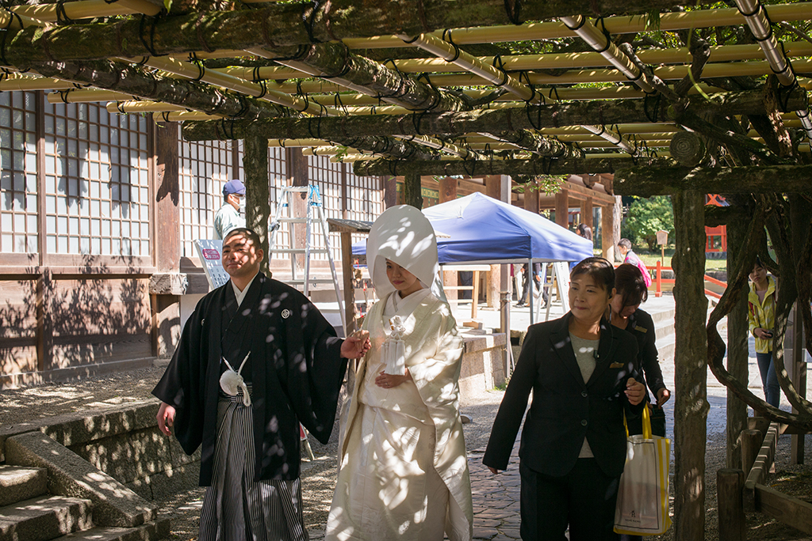
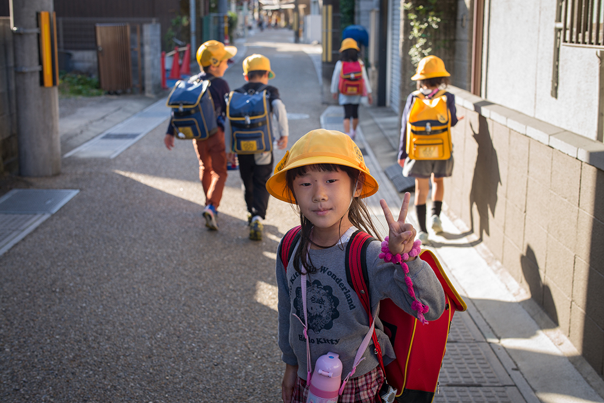

2016年10月，第二次来到日本。这次的目的地是京都及周边地区。我们找了地铁站附近的民宿住下，开始在京都的漫游。上一次来京都的时候因为行程紧张，只是匆忙一瞥。这次把京都城和周边主要的地区慢慢地逛了一遍。喜欢京都的传统文化氛围，不像发达城市那么现代化，这里保留的所有传统文化都给人非常舒适的感觉。

穿梭在小巷，遇见几个打扮成艺妓模样的人在拍摄写真。

街头拉车的小伙，看到我的相机，停下来给了我一个微笑。车上的乘客也配合地竖起剪刀手。

日本的中学生穿着统一的白衬衫，推着自行车准备过马路。

马路的天空上各种电线穿行，充满古朴的气息。

在街头小店门口的“导购”，指引行人进店选购。

在一户人家门口，一名快递员正在派送邮件。

路边遇见一个表演者，全身涂白色模拟雕像。吸引了很多路人观看。突然他回过头，咬着舌头做鬼脸。

在奈良的春日大社，正好遇见一对新人举办婚礼。新娘身着白色传统礼服“白无垢”，代表清洁无垢。

在宇治品尝完抹茶小点心后，在街道上遇见一群放学的孩子。小女孩可爱地和我们打招呼，真像小丸子。

---
##交通Tips

国内坐飞机到大阪或名古屋，然后搭乘JR或新干线到达京都。

京都可以坐地铁或公交出行，有一日和多日券。

---

