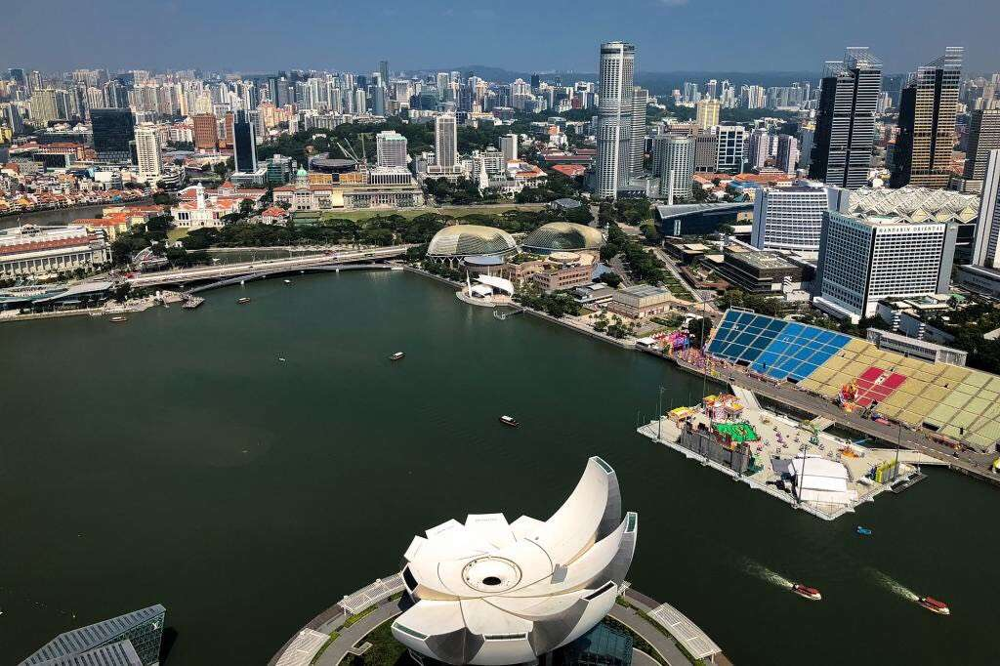
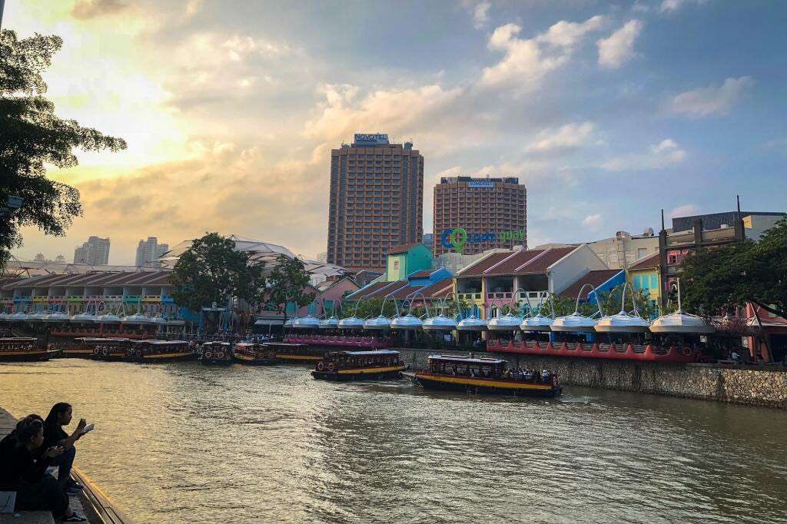
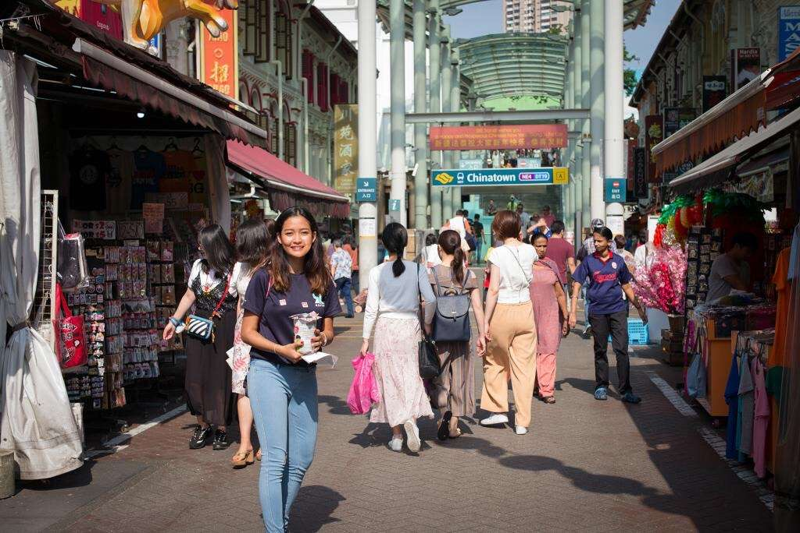
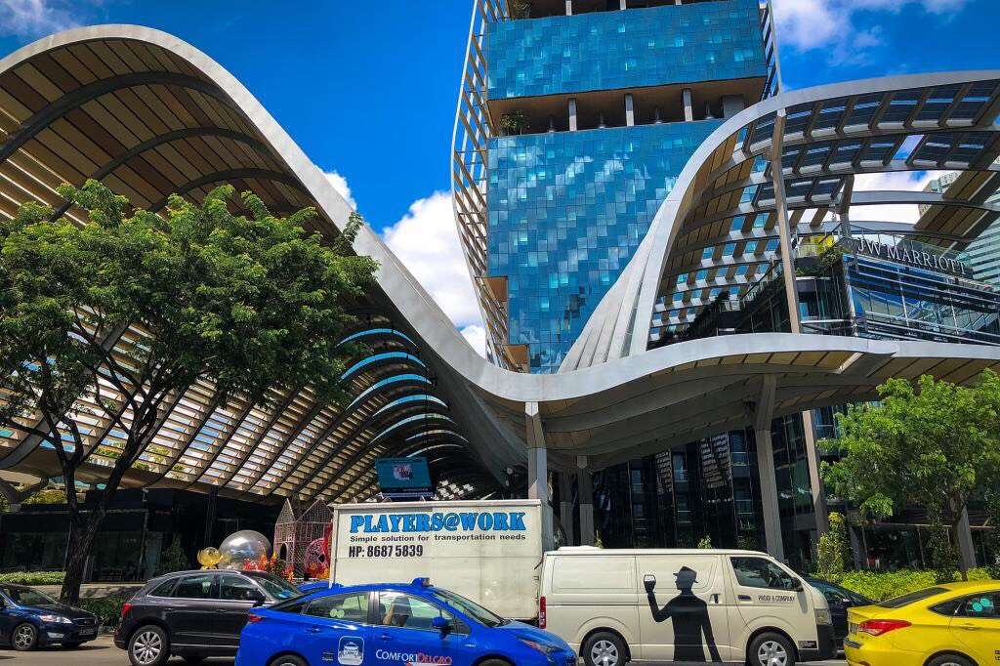
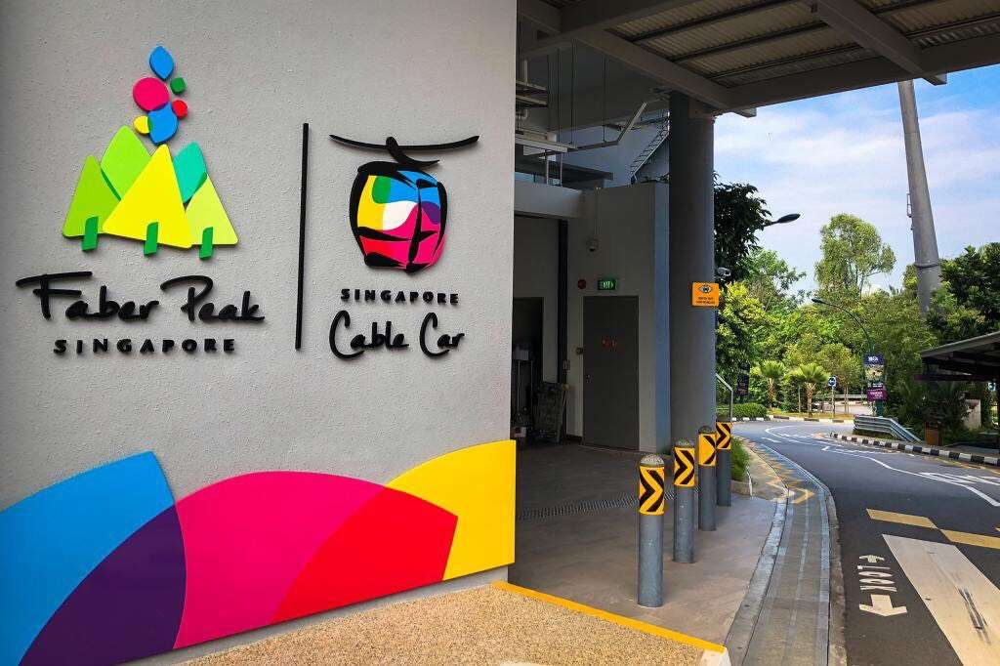
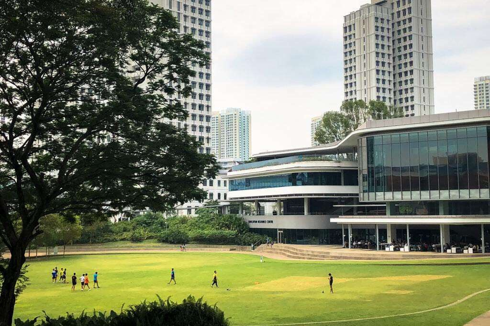
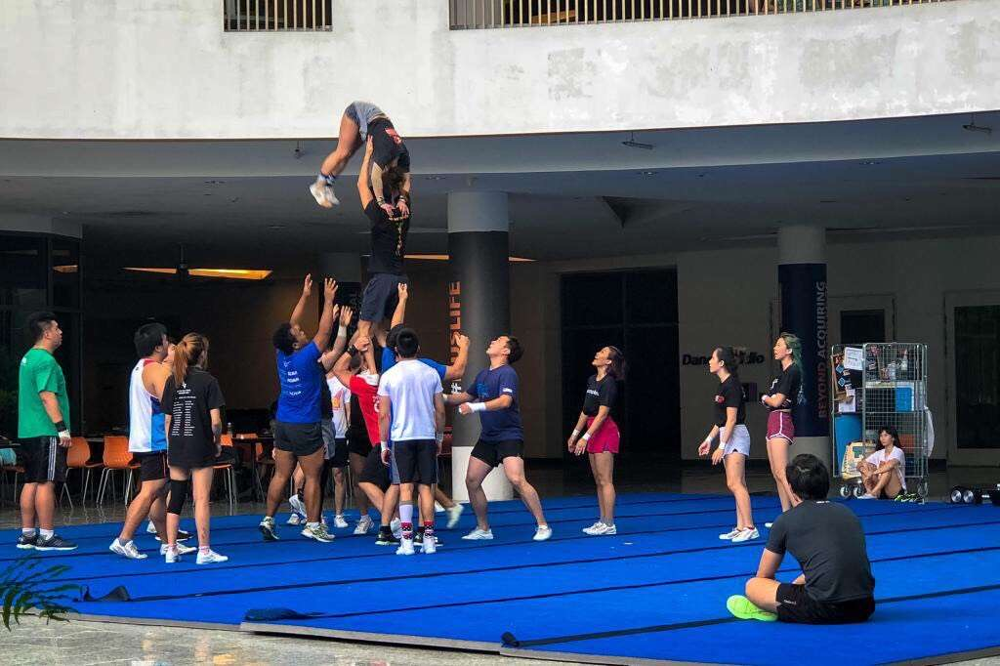
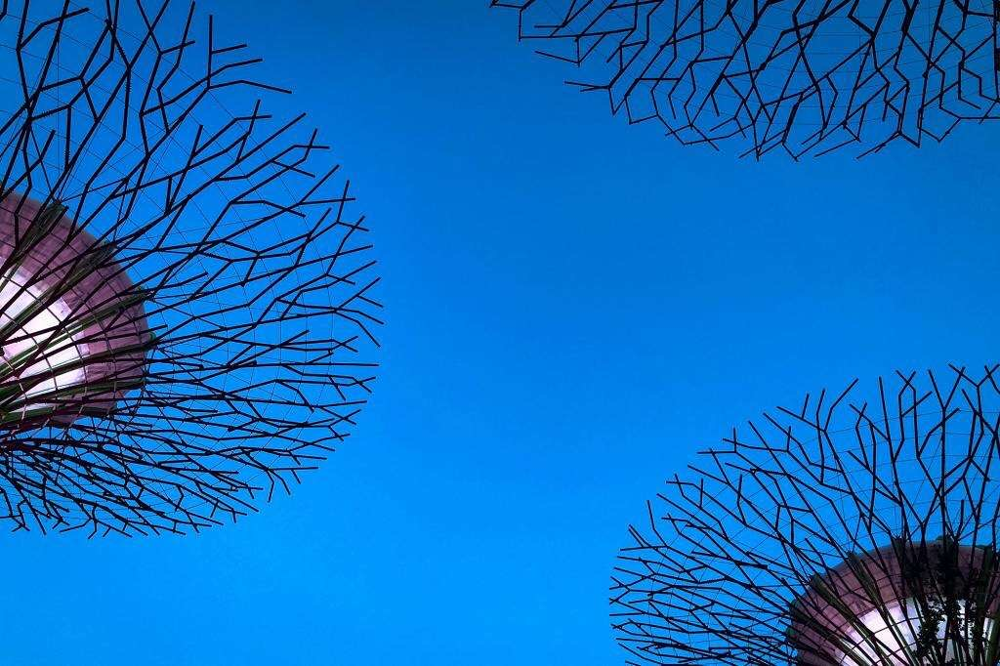
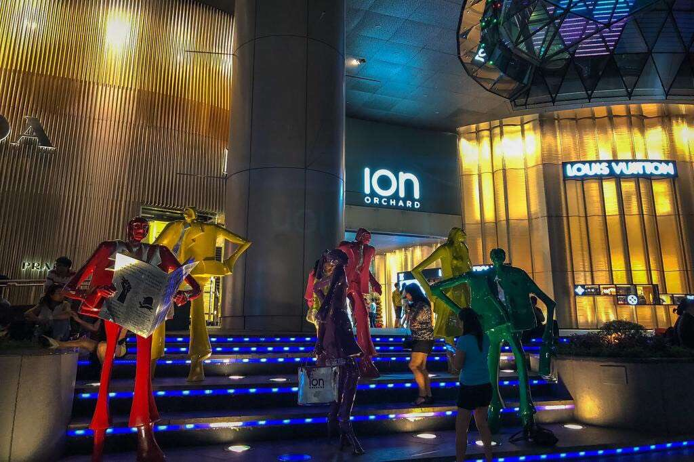

2018年2月9日，我们来到美丽的新加坡，在一周时间里，住在居民社区的公寓楼，出门坐地铁，游玩了克拉码头、金沙酒店、圣淘沙岛、牛车水、国立大学等著名景点，干净整洁的城市给我们留下了深刻的印象。

---

##交通Tips

新加坡的交通以地铁为主，基本所有景点都可以坐地铁到达，部分景点需要坐公交车。提前查好要去的地方，通过google地图App查询乘坐线路，非常方便。

---
