2019年4月14-15日，一年一度的日本春之高山祭在岐阜县高山市举行。14日上午是花车展和人偶表演。早上8点半左右，花车就从库房里拉出来，一路拉到中桥附近展出。原定11点的人偶表演，因天气预报会下雨而提前到10点开始。现场人山人海。因下午下起了雨，临时取消了当地居民的巡游活动，以及晚上的花车夜游活动，甚是遗憾！
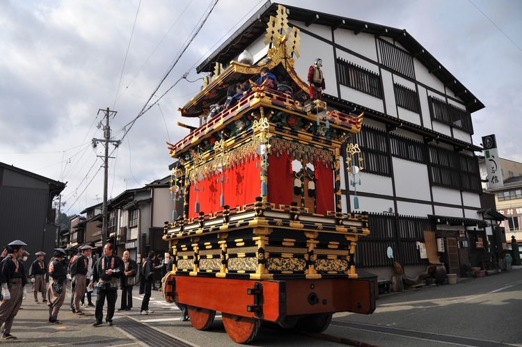

早上，花车从各库房拉出来，穿过长长的小巷，到展出地点供大家参观。
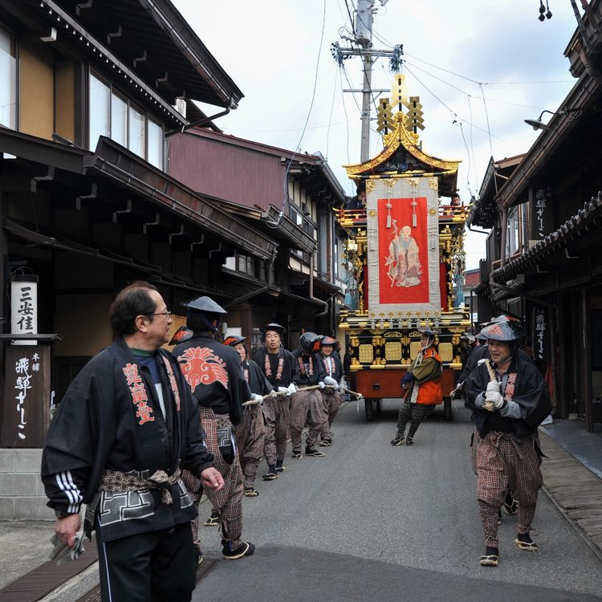

每一台花车都由2排拉夫在前面拉，花车后面有一名车夫负责控制方向。只见他用力推拉花车后面的长长木棒，通过木棒的方向来调节花车轮子的转向。小小巷子出来的转弯都难不倒他。
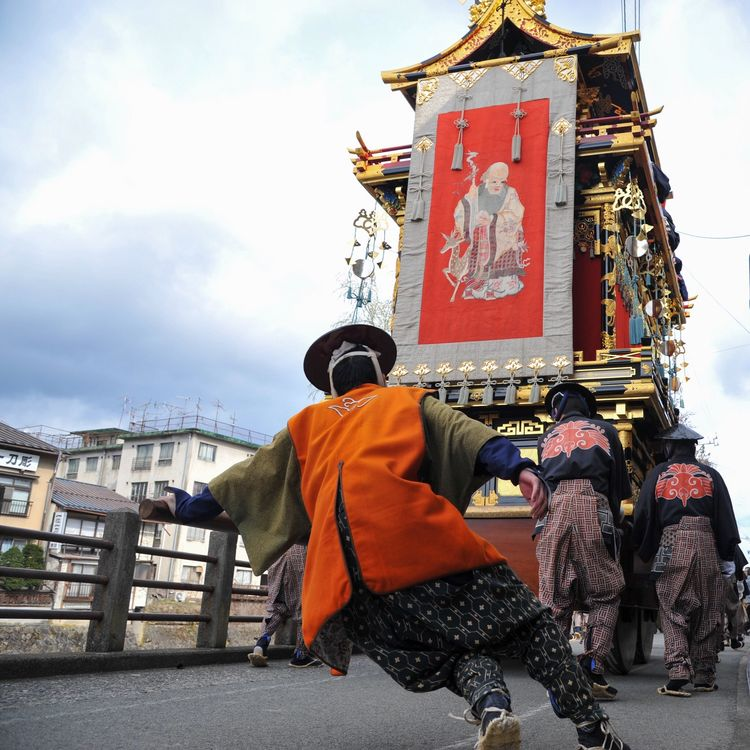

花车到了巷口，要转向到大路上，每台花车重达好几百斤，花车的转向需要通过前后车夫齐心协力才能完成。
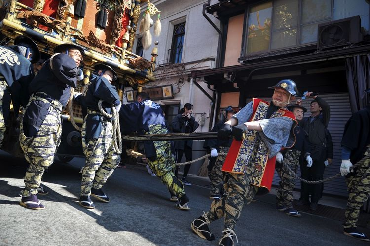

几台花车到达展出地点后，一字排开。周边围满了观看的人群，有当地居民，有慕名而来的国内外游客。
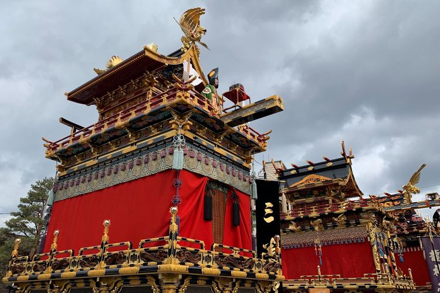

每台花车上，都有表演的人员，是由专业表演人员和孩子们组成。在花车穿过街道时，他们就开始在上面表演。
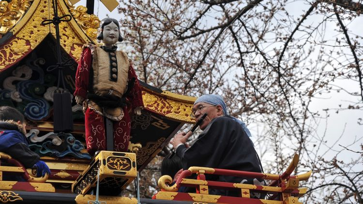

10点，花车的人偶表演开始。传统的日本音乐伴奏下，花车最上层的人偶开始缓缓从车里走到前端。表演人员控制人偶，在音乐的伴奏下舞蹈。
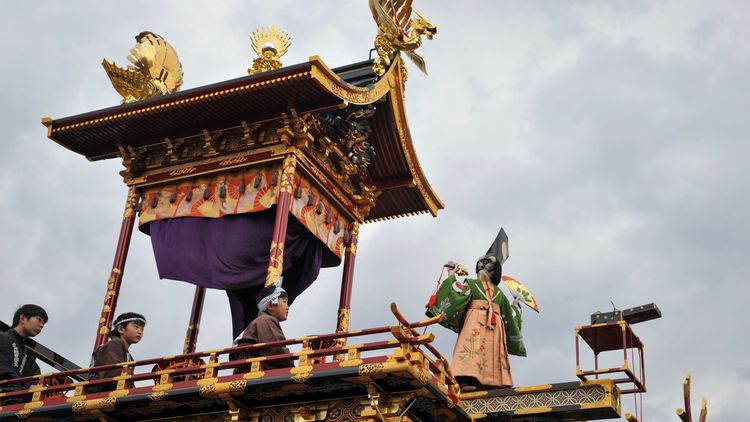

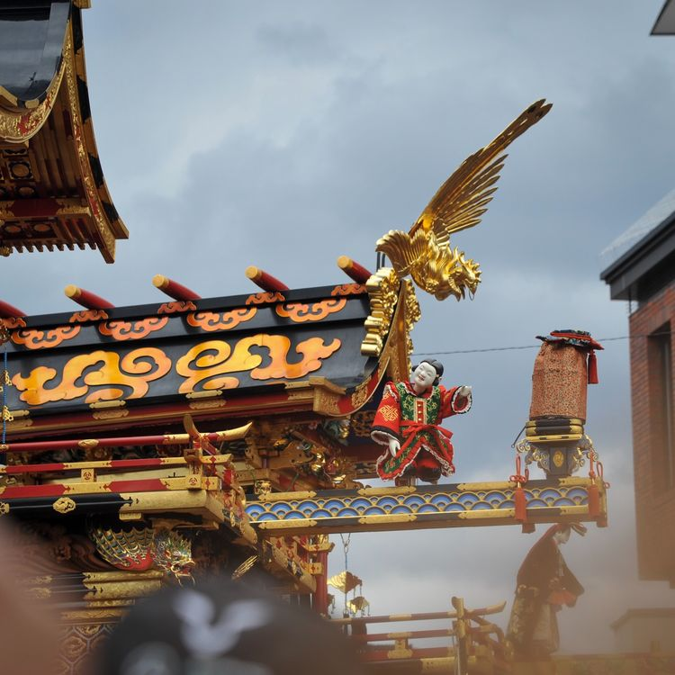

15日，天气晴朗。一早就出门再次去看花车展。蓝天白云下，花车停留在红桥上供大家观赏，红桥附近，还有仅存的几支樱花，映衬着蓝蓝的天和彩色的花车，非常美。
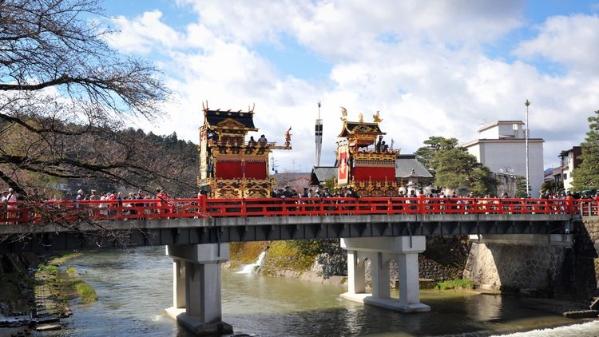

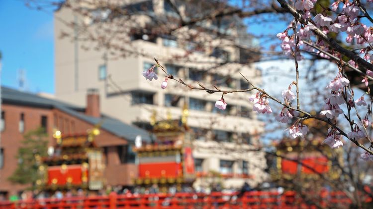

花车展附近，有当地居民组成的狮子队游行活动，长长的队伍有表演狮子的，有吹奏乐器的，一路走来，到山上去了。
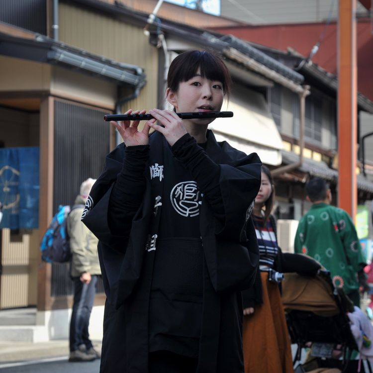

当地居民纷纷穿着传统和服，一起来参加这每年举办的“春之高山祭”。
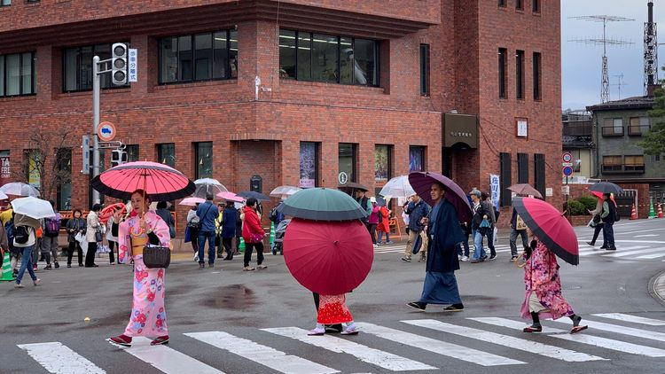

##交通Tips
###名古屋 - 高山市
从名古屋中部国际机场到高山市，可以买联票，到岐阜县换乘大巴。联票的时刻表查询和预约，[点击直达](https://www.nouhibus.co.jp/other/centrair-to-takayama_zh/)

###高山市 - 名古屋 
从高山市到名古屋市，可以乘坐浓飞巴士。时刻表查询预约：[点击直达](https://www.highwaybus.com/gp/reservation/rsvPlanList?mode=search#busPlanList)

