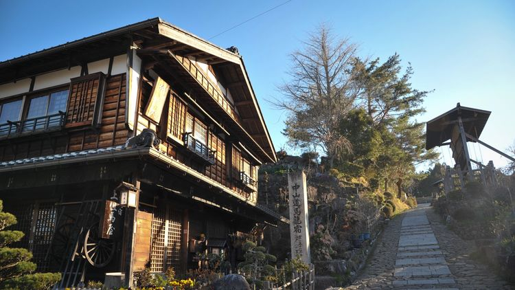
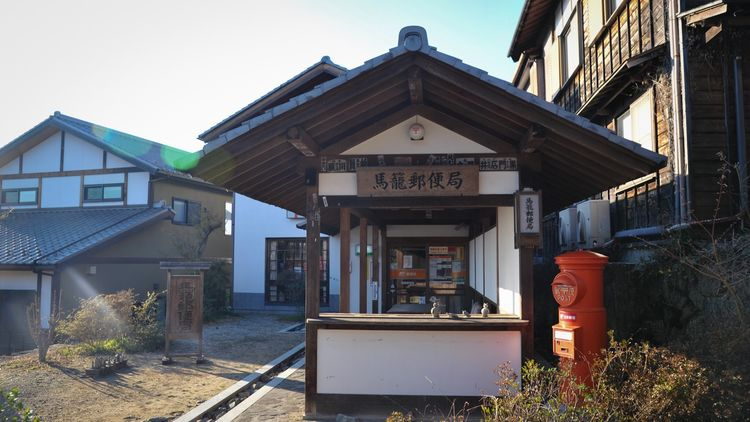
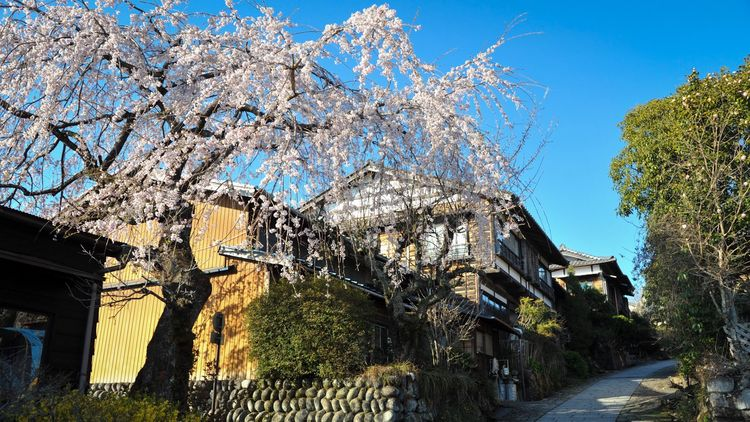
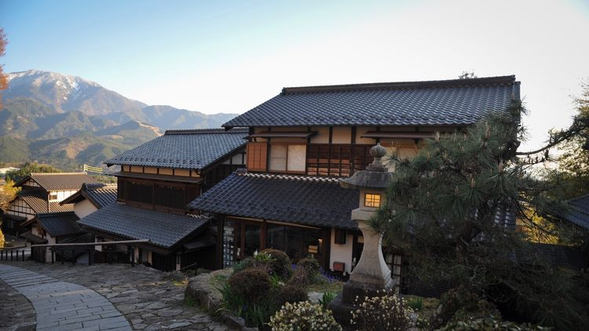
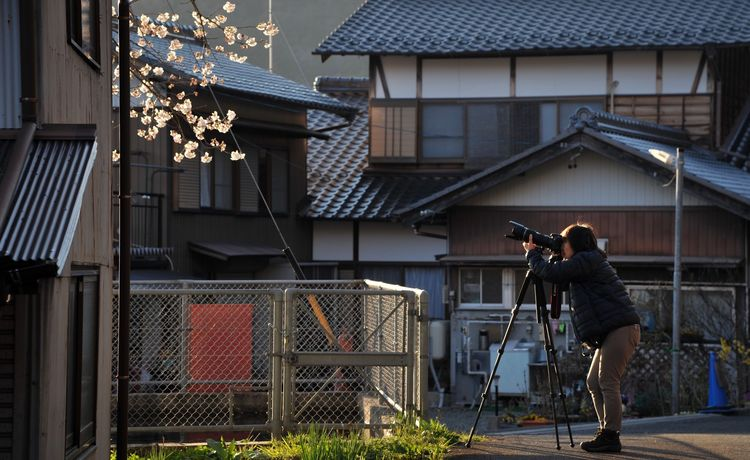
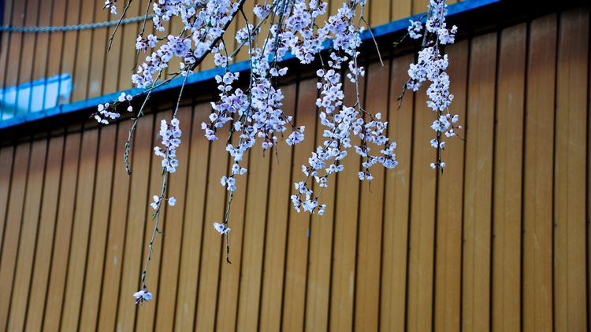
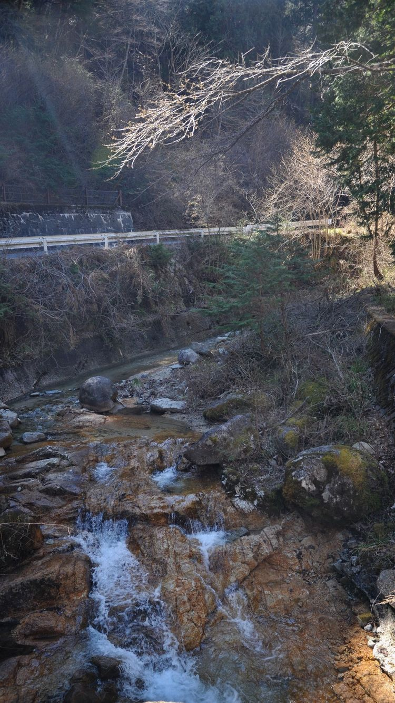
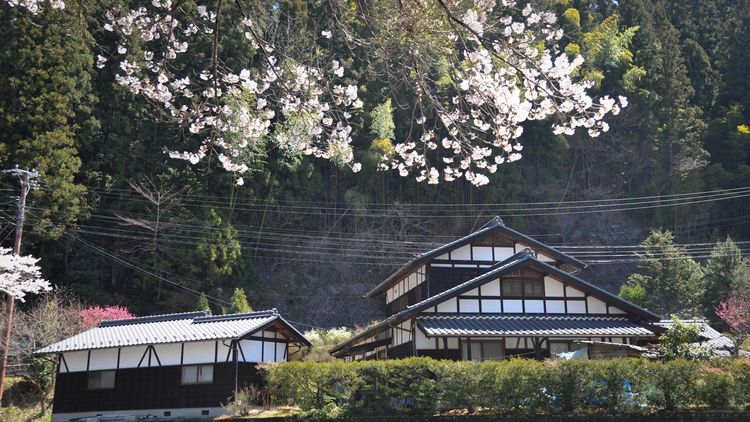
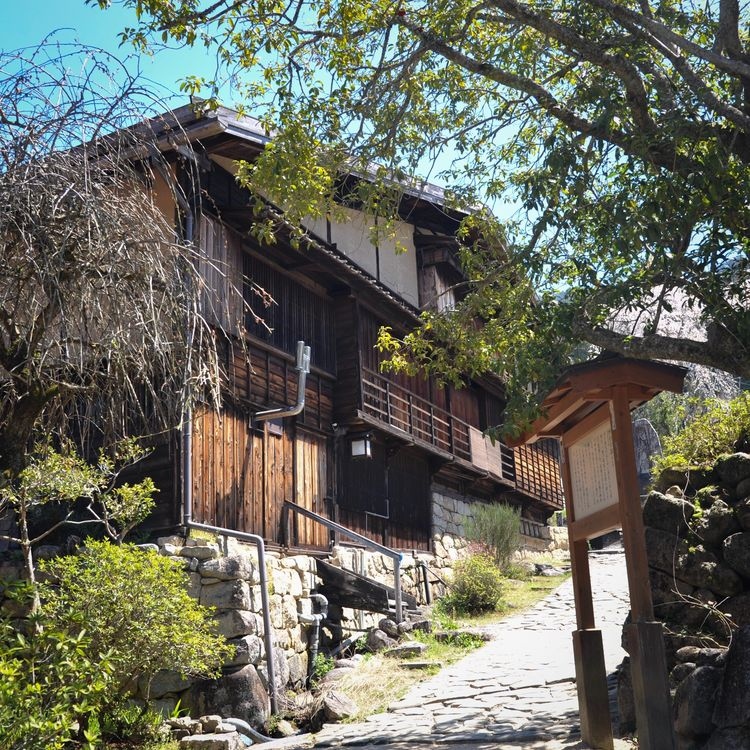
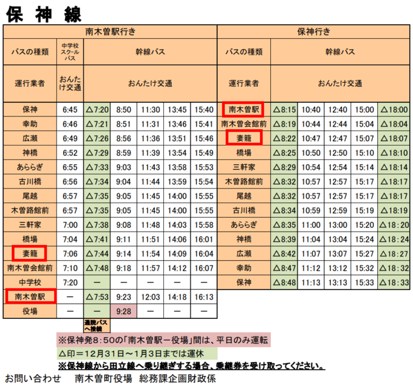

中山古驿道是日本江户时代连接东京和京都的一条驿道，马笼宿和妻笼宿分别是驿道上第43和42号驿站。根据古貌修复的马笼宿和妻笼宿建筑，以及保留的两地之间7.7公里长的古驿道，吸引了世界各地的游客前来体验。2019年4月15日，我来到马笼宿，准备第二天从马笼宿出发，徒步中山古驿道道去到妻笼宿。

下午3点多到达马笼宿，我先四周逛了一圈，地方不大，非常安静。这里大多是西方人入住，没有碰到一个中国人。

傍晚，太阳逐渐下山。夕阳下，传统的日本建筑在渐渐暗淡的天色中，暖色的灯光亮起，仿佛置身动漫之中。

无意中转过一条小道，发现有几株樱花还在盛开。一名摄影人支着三脚架在拍摄，夕阳在她的头顶打出一轮亮光。

第二天早上8点，我从马笼宿出发，古驿道穿过树林，并不难走，但有较长的上坡路段，背着相机行李还是稍有点累。中途有一个休息站，可以免费喝茶和吃小零食，不仅补充体力，还可和休息的老外交流聊天。一路上没有第二个中国游客，全部是西方人。

一路走走停停，历经3个小时终于到达妻笼宿，妻笼宿保留了很多当年的建筑原貌，可以看到当时的建筑风格和设计结构。

---

##交通Tips
###名古屋 - 马笼宿

名古屋市名铁百货三楼的名铁巴士总站（Meitestu Bus Center）乘坐巴士前往。下车后步行约10多分钟到达。 

名鉄BC - 昼神 - 飯田商工会館，MB线。

车票预约：[点击直达](https://www.highwaybus.com/gp/inbound/inbPlanList?lineId=610&offStationCd=388)
时刻表查询：[点击直达](http://www.shinnan.co.jp/hb/hb02_time_3_1.html#link)

###妻笼宿 - 名古屋

妻笼宿乘坐公共小巴“保神线”，到南木曾，换乘JR线。
####妻笼宿 - 南木曾（なぎそ）

####南木曾（なぎそ）- 名古屋
ＪＲ中央本線・中津川行，原车站转ＪＲ中央本線快速・名古屋行

--- 