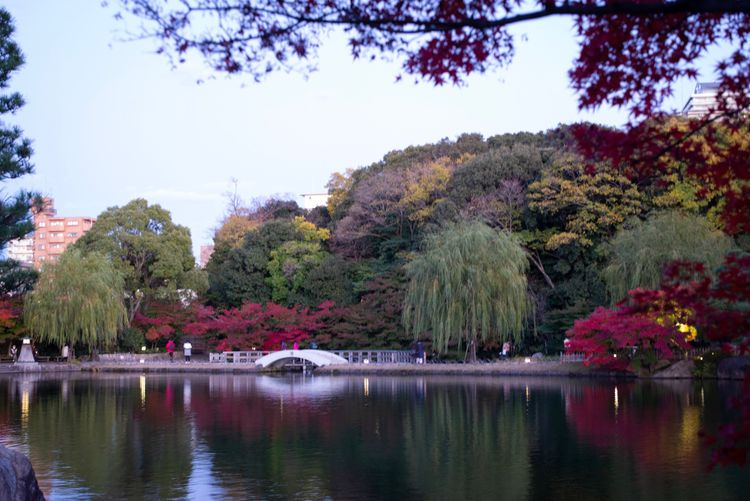

2019年11月28日，赴名古屋，趁深秋枫叶🍁正红，到日本三大赏枫胜地之一的香岚溪赏枫。香岚溪离名古屋40多公里，坐地铁和巴士，从名古屋出发一个多小时即可到达。

香岚溪的枫树有上千株，到处是红色、黄色、五彩色。

---

##交通Tips
###名古屋 - 香岚溪

名古屋 - 八草站 - 香岚溪

（1）名古屋坐地铁：东山线（Higashiyama Line），藤丘方向，到藤丘站（Fujigaoka），车程28分钟；

（2）藤丘站换乘磁悬浮：东部丘陵线(LINIMO）,到八草站（Yakusa Station），车程18分钟；

（3）八草站乘坐巴士：OHWA Line （直行巴士），直达香岚溪（Korankei）

    *这条线路每年限定时间开放，为香岚溪红枫祭期间，2019年开放时间是9月11日-30日*

###香岚溪 - 名古屋

按照上面线路返回即可。

---
