时光荏苒，岁月更迭。转眼间忙碌的一年已经过去，伴随着激情与挑战，新的一年即将到来。值此辞旧迎新之际，2020年宁波铭盛软件新春晚会暨年终表彰大会于2020年1月10日在宁波威斯丁酒店隆重举行，铭盛全体员工欢聚一堂，共话今昔。
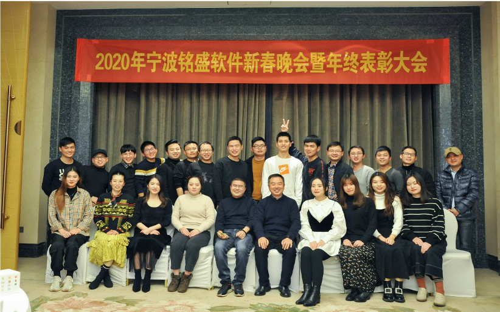

##年度颁奖

晚会伊始，公司总经理胡敏雁和常务副总罗夕青分别作新年致辞，回顾过往铭盛软件所取得的成绩，展望未来美好前景，并对员工表达了深切的祝愿。两位领导的讲话令人振奋，员工们激情澎湃，满怀憧憬。
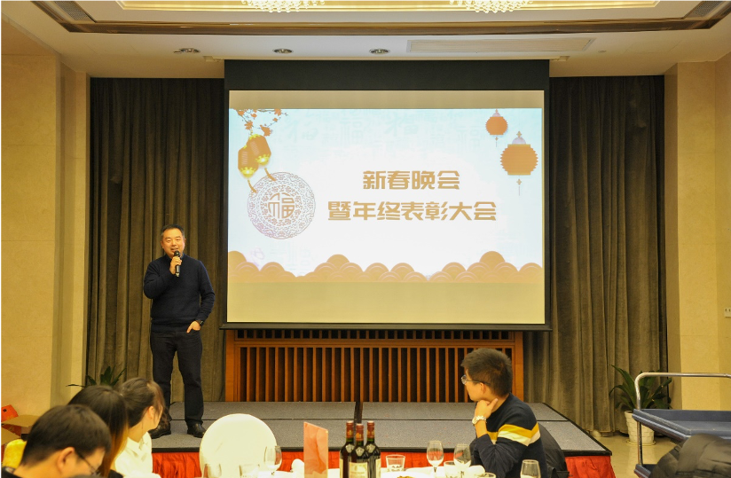

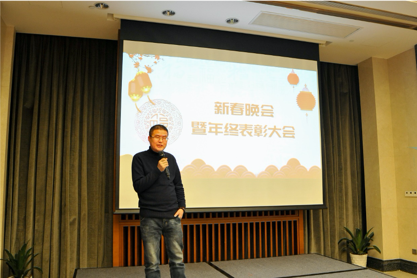

铭盛软件在2019年交出了一份满意的答卷，离不开每一位员工的辛勤耕耘，致辞结束后，常务副总罗夕青主持颁奖典礼，由总经理胡敏雁和常务副总罗夕青共同为优秀员工奖获奖者夜丹鹏和梁海明颁奖。
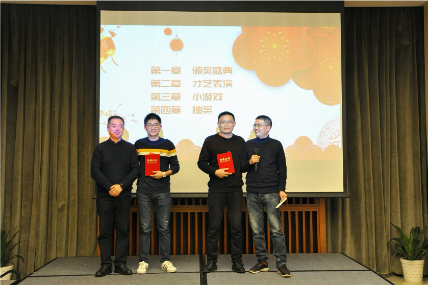

由常务副总罗夕青颁发最佳新人奖，获奖者陈凯敏。
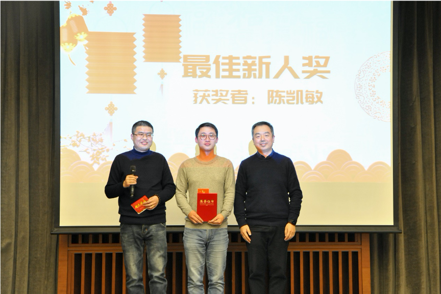

##才艺表演

晚宴正式开始后，大家各展所长，新员工为大家带来了精彩绝伦的视听盛宴，一首流行音乐《消愁》拉开了晚会的帷幕，希望每位同事能消去一年所有的忧愁。
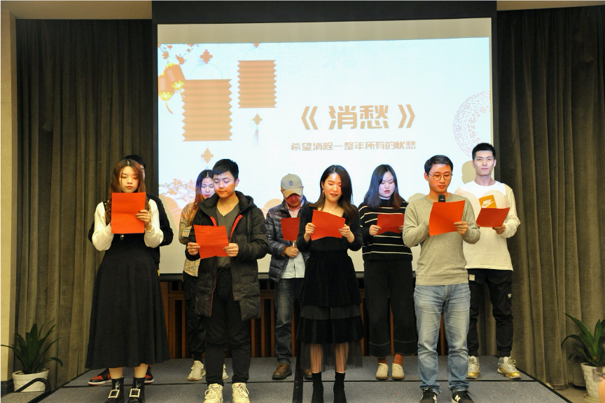

现场暖意融融，两位领导带领着老员工为大家带来了饱含真情的诗歌朗诵，和一首《明天会更好》，希望铭盛软件的明天会越来越好。在铭盛软件的舞台上，魅力与风采在这一刻光芒毕显，璀璨万分。
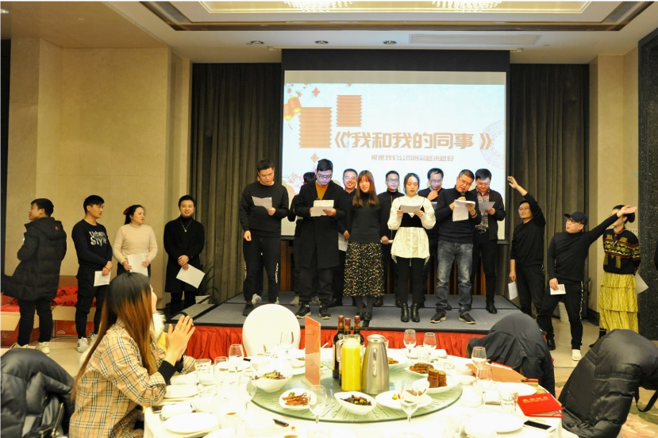

##抽奖和游戏

伴随着一段段汇演，令人激动万分的时刻到来了，丰厚的奖品令现场每一位都热血沸腾，将活动氛围推向了高潮！
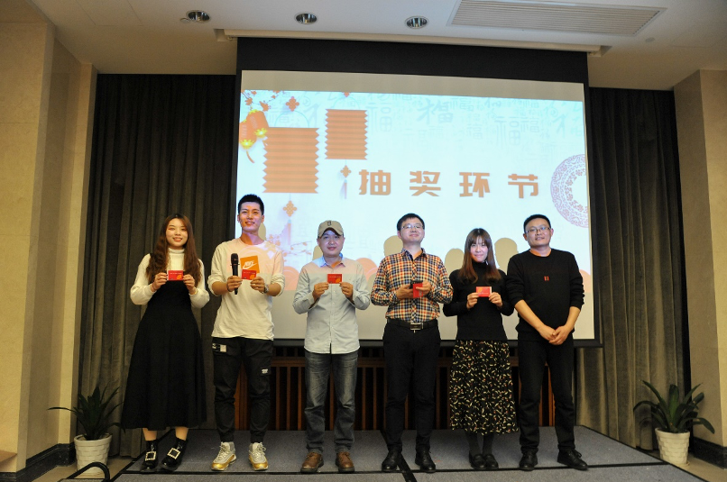

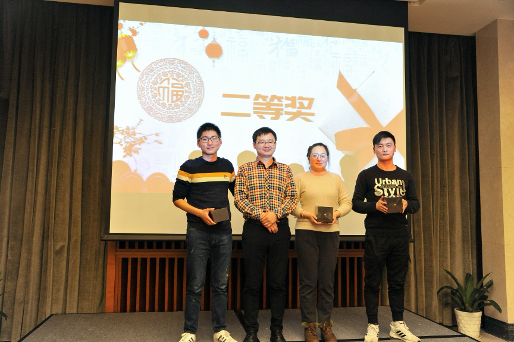

随着三等奖和二等奖的抽取，中间还穿插着小游戏环节，小游戏《弹瓶盖》和《看眼色》，给大家带来了欢声笑语，同时也让同事之间彼此的心更加贴近。
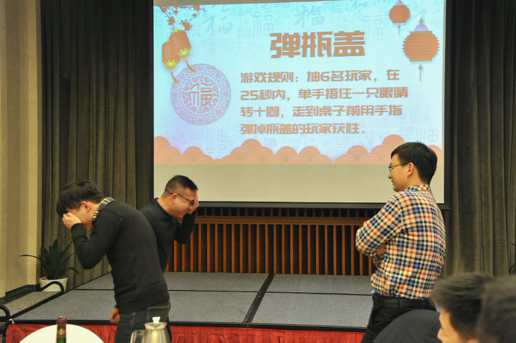

随后，现场气氛到达了沸点。由常务副总罗夕青抽取了当晚的一等奖，一等奖由蒋宁宁获得。
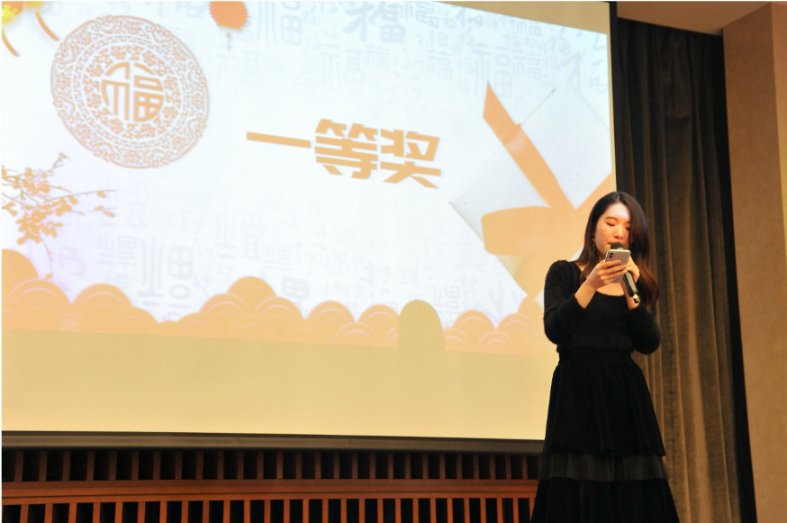

最后总经理胡敏雁抽取了特等奖，特等奖由徐尚有幸运地获得。
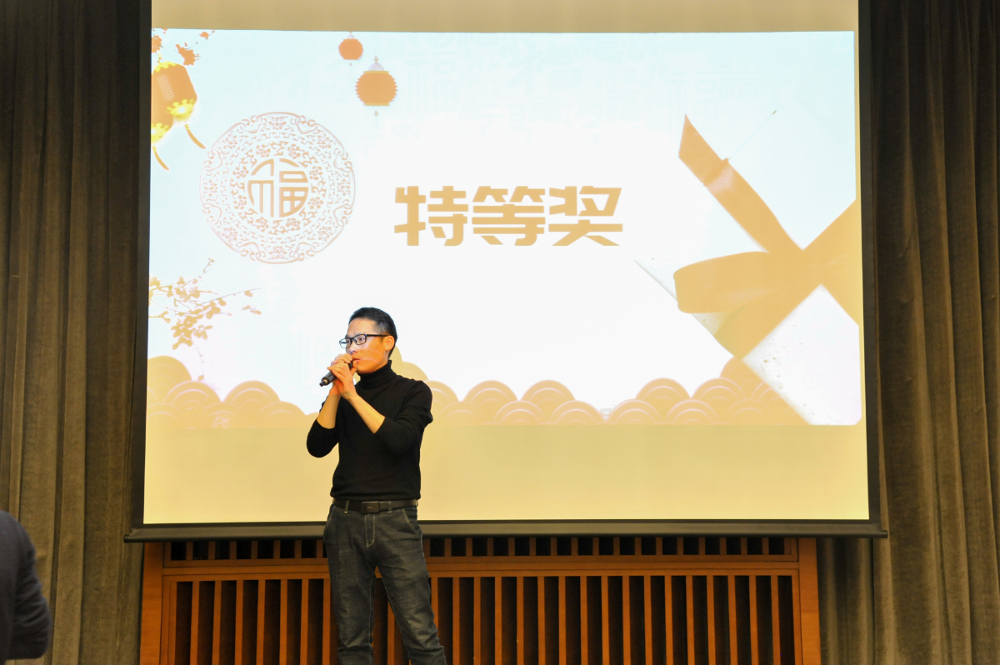

整个年会在和谐、温馨、激情、欢乐的气氛中圆满落下帷幕，回首2019，我们齐心协力，努力拼搏；展望2020，我们目标一致，信心满满。新年晚宴上全体同仁为新的一年举杯同庆，共同期待铭盛软件的明天会更加辉煌！
