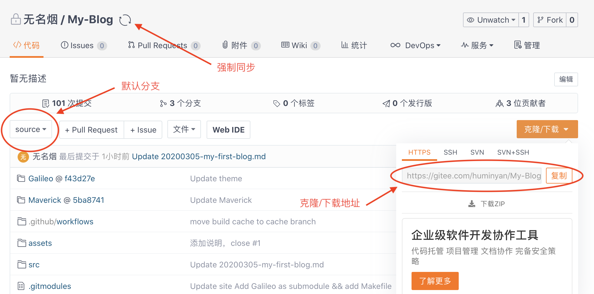

1. 在码云中新建一个仓库
2. 选择“导入已有仓库“，在地址栏输入Git的仓库地址
3. 按“新建”，等待从Git导入完成
4. 在码云选择“克隆/下载“，复制地址
5. 在电脑的终端输入指令：git clone "刚才复制的地址"

亲测，下载速度飞起。

需要注意：
1. 码云的仓库设置中，需要去设置默认的分支是哪个（比如：source）
2. git上更新后，下次下载前，要在码云上先强制同步一次。

