保国寺位于浙江宁波市江北区洪塘镇的灵山之麓，始建于东汉世祖时期，初名灵山寺。唐会昌五年寺宇被毁，广明元年（880年）重建，僖宗李儇赐“保国寺”匾额，此后改名为保国寺。保国寺因其精湛绝伦的建筑工艺令人叹为观止，寺内的大雄宝殿（又称无梁殿），是长江以南最古老、保存最完整的木结构建筑之一。

1954年全国文物普查时南京工学院师生发现此古建筑，后经陈从周、刘敦桢教授核实为北宋建筑。

趁五一假期最后一天，又一次来到保国寺。山上空气清新，游客稀少，从山门进入，穿过无梁殿，一路向上，最终到达藏经阁。气温不是很高，但也走的微微冒汗。每次来到这1000多年前的古建筑保国寺，都会被古人的智慧和匠心所感动。

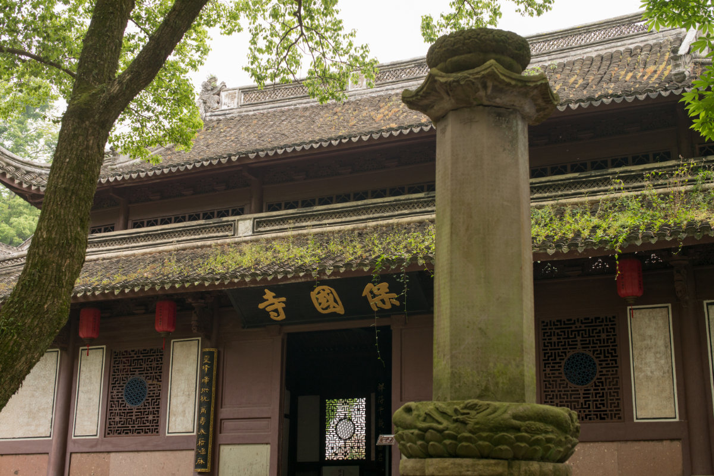

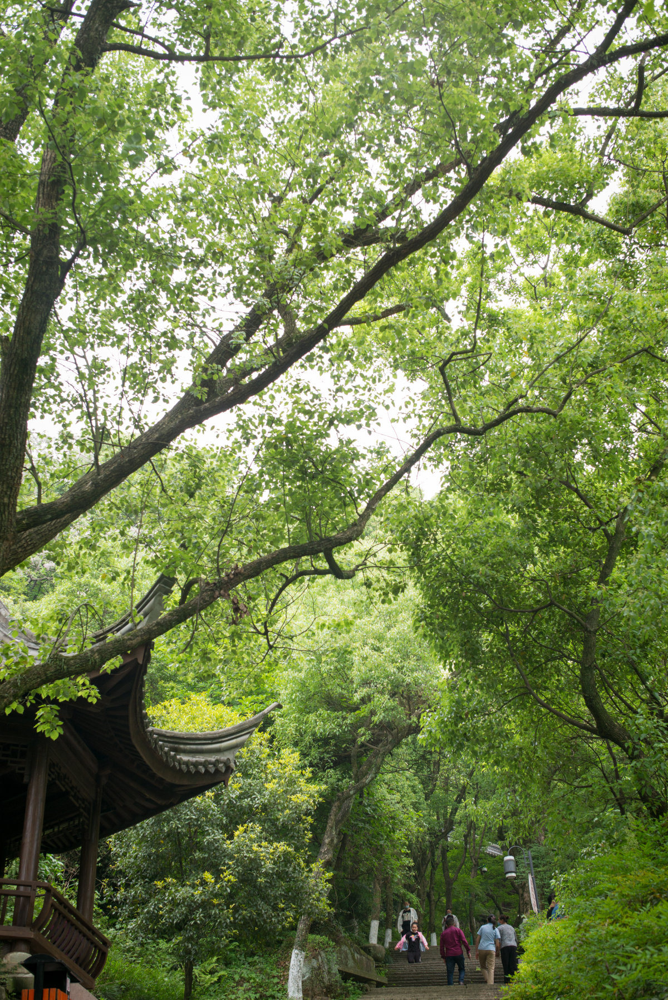

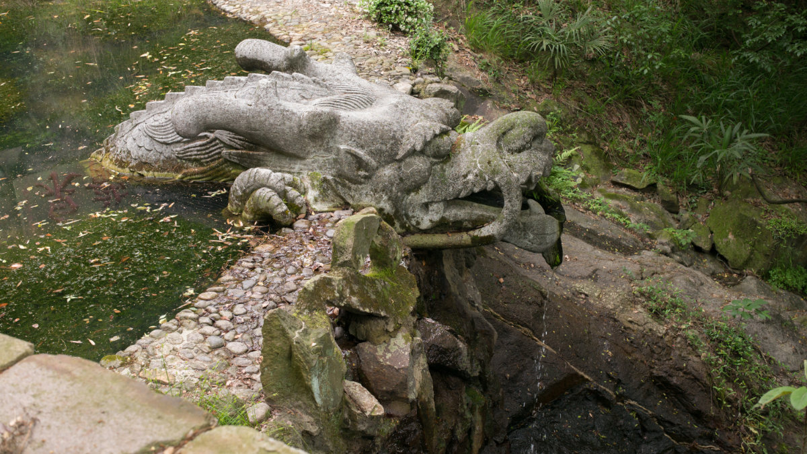

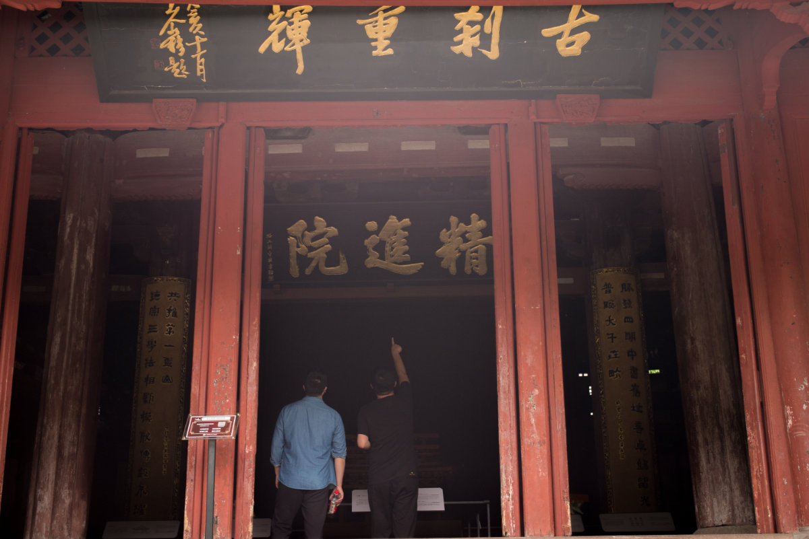

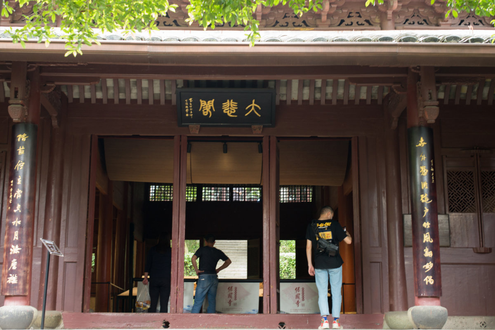

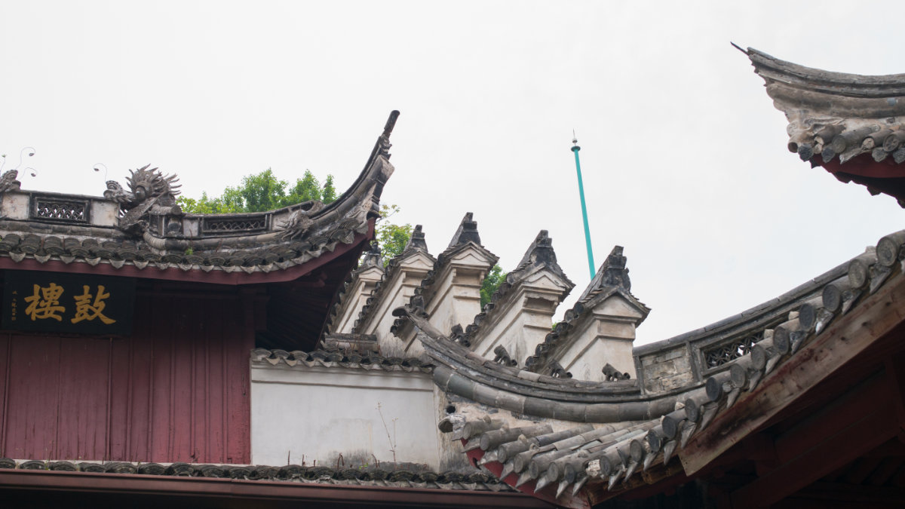

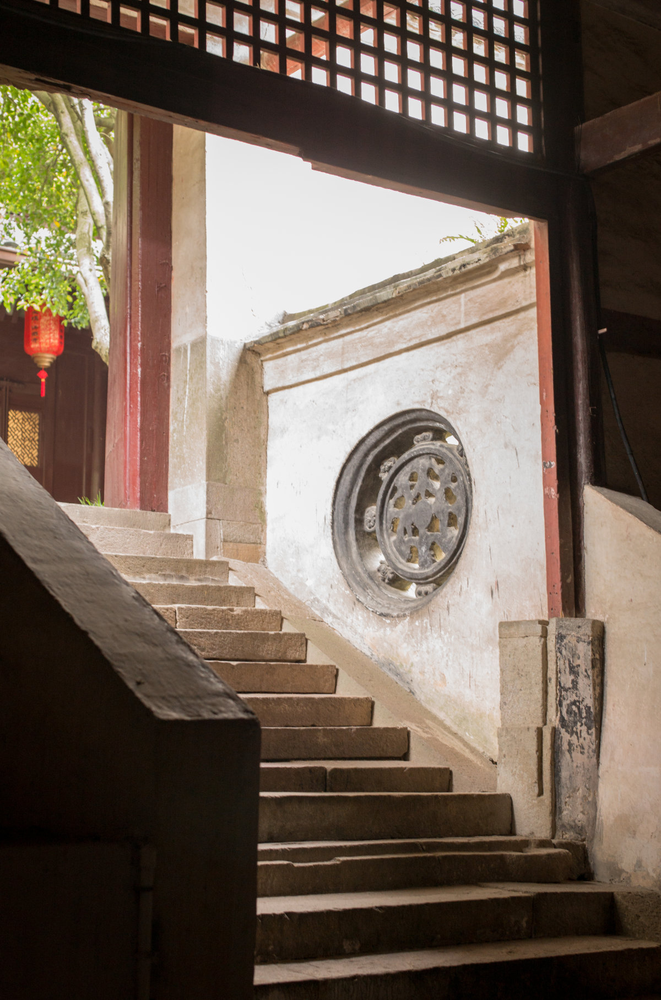

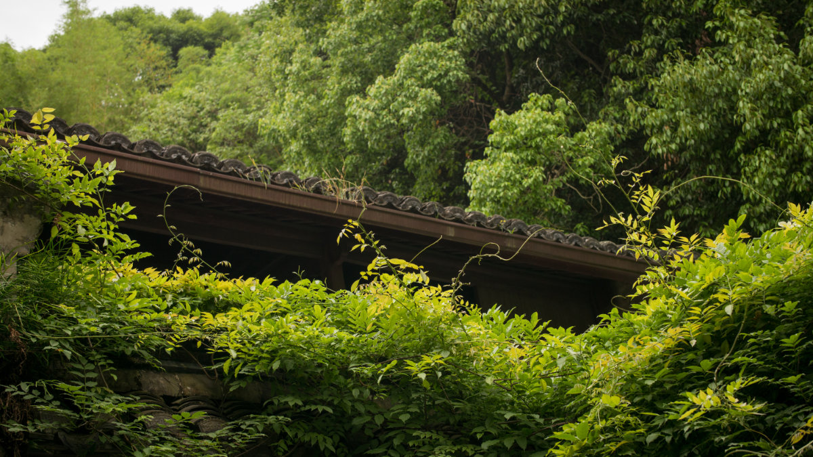

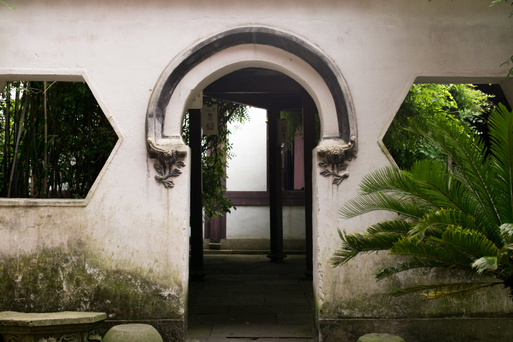

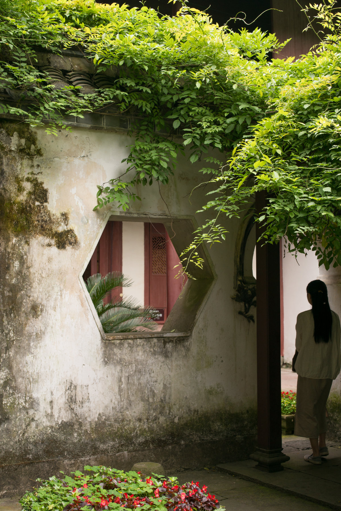

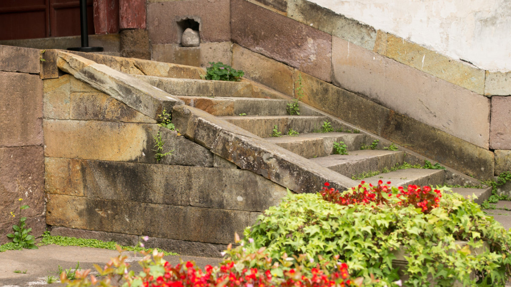

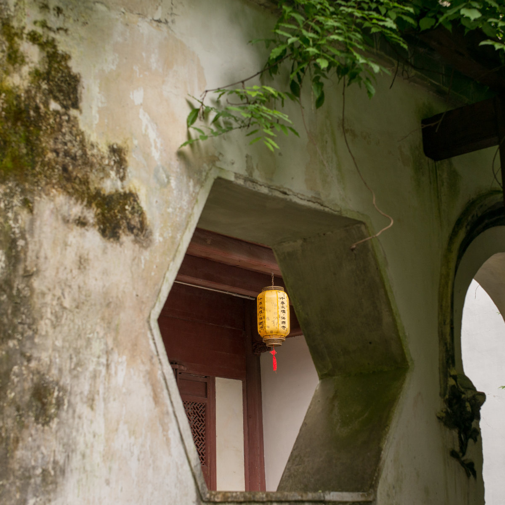

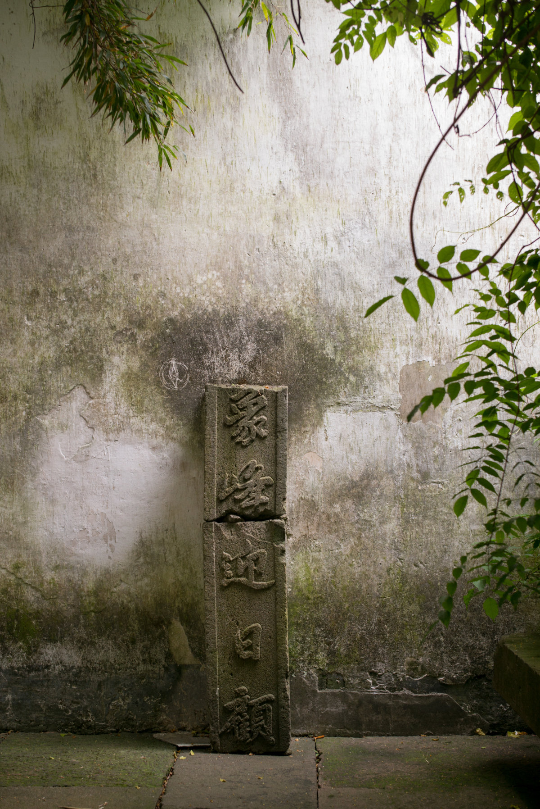

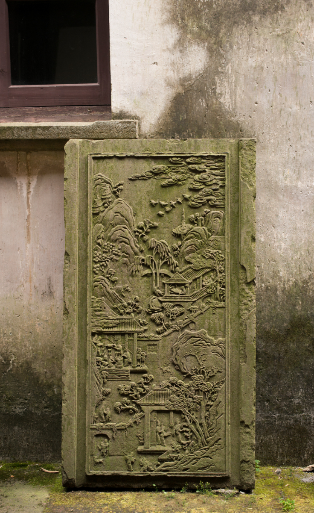

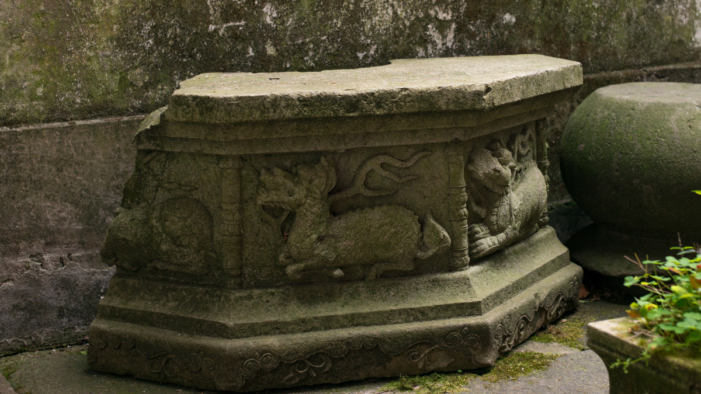
