渔山列岛位于浙江省宁波市象山县，距石浦东南27海里（约合45公里），岛礁棋布，暗礁林立，海水清澈。渔山列岛处于南北洋流交汇带，鱼类、贝类、藻类资源丰富，共计各种海洋特产300余种，被誉为“亚洲第一钓场”。

2020年5月23日，我们第一次来到渔山列岛休闲游。从石浦坐船约2个多小时，经过一路风雨颠簸，终于登陆小岛。渔山列岛有南渔山和北渔山之分，我们常说的渔山岛通指北渔山。北渔山仅0.5平方公里，有丰富的淡水资源，目前有三四百人居住。

上岛第一天阴，参观了著名的“远东第一灯塔”。灯塔始建于光绪二十一年，如今岛上的灯塔是1985年交通部批准原址重建的。参观完灯塔，用了2个多小时绕岛漫步一圈，空气清新。

第二天去海钓，风浪有点大，收获不多，钓到几条小小的虎头鱼。中午时分，太阳终于露出脸来，天空一下变得很蓝，海水也随之变成深蓝。赶紧抓起相机，冒着烈日去拍了一些照片。

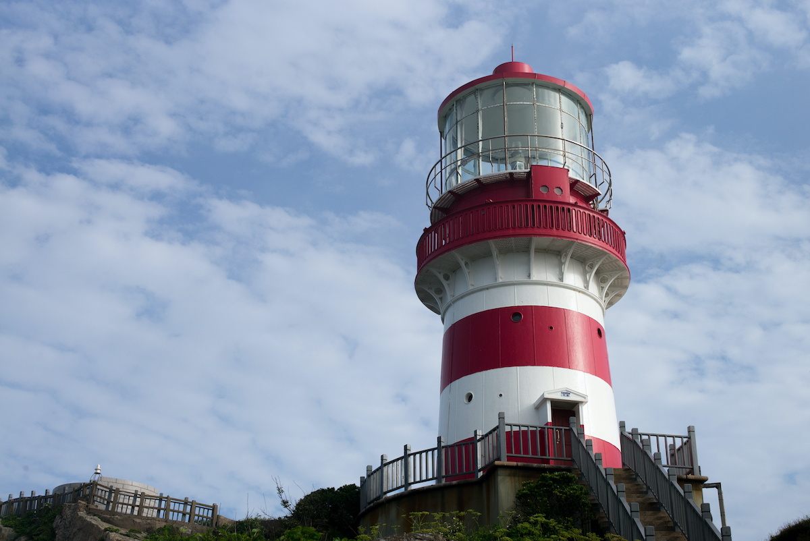

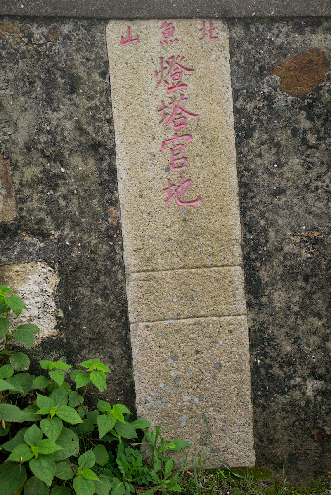

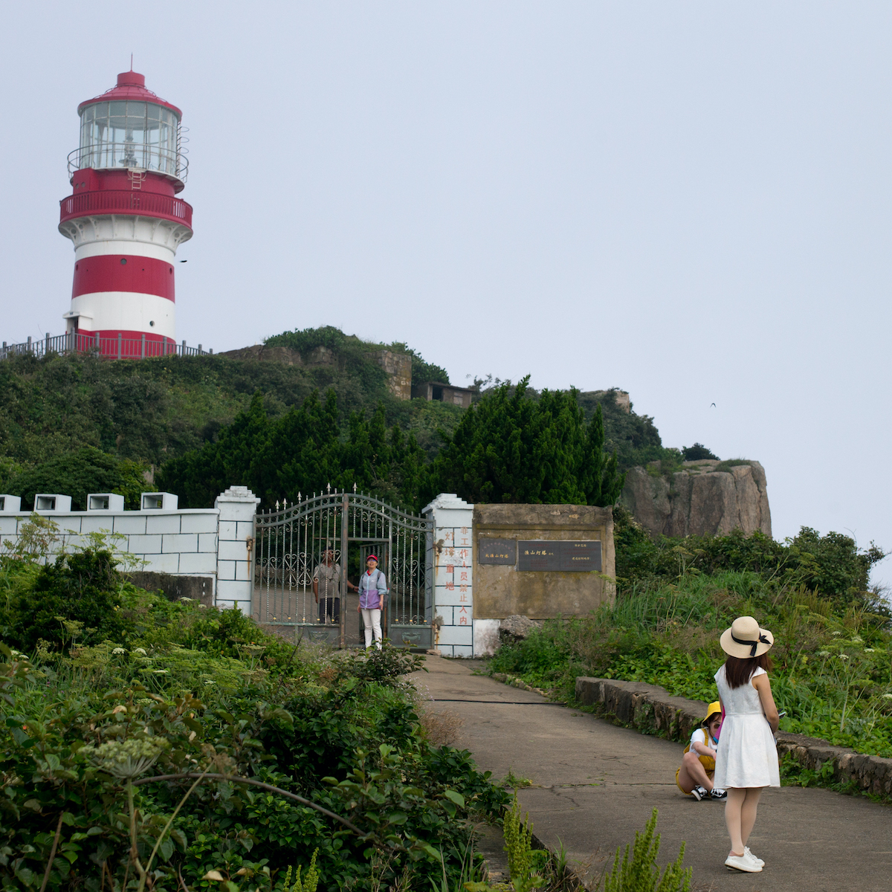

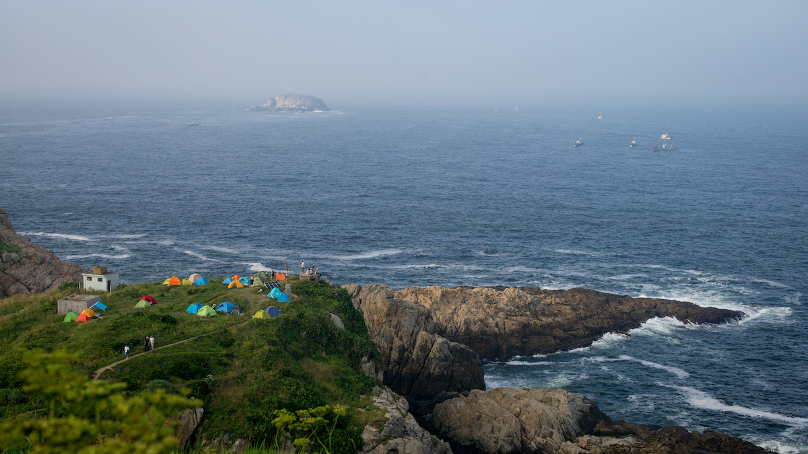

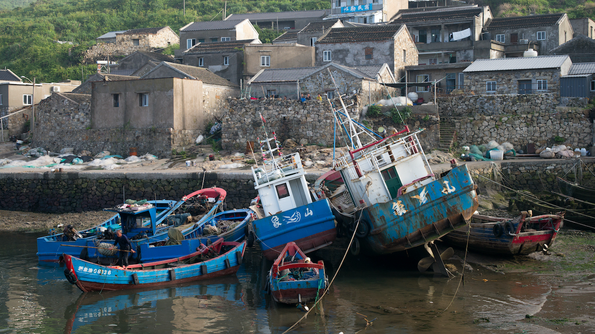

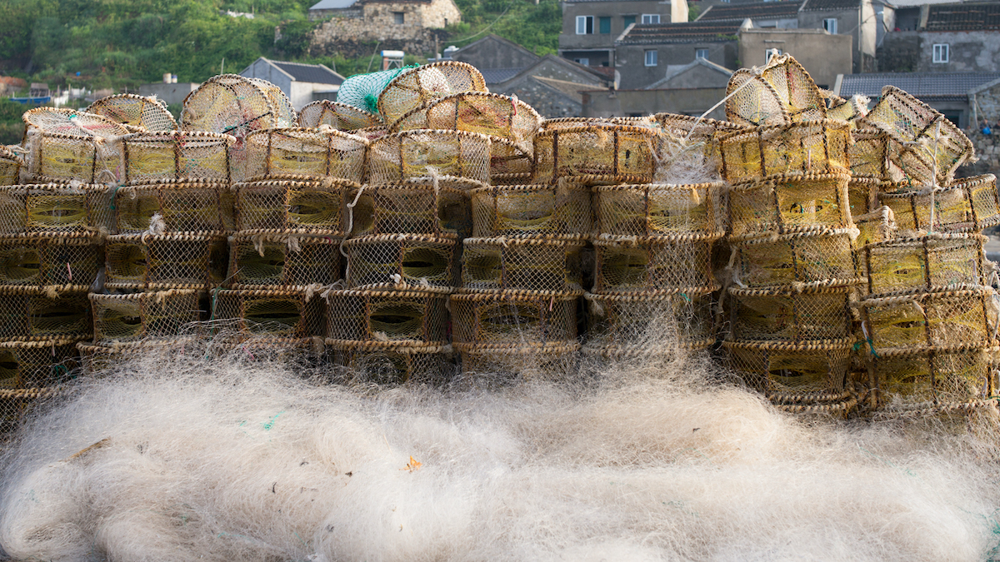

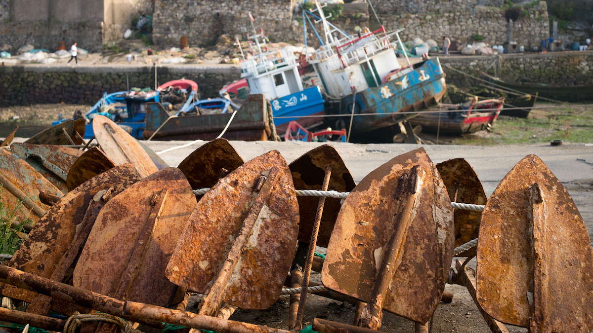

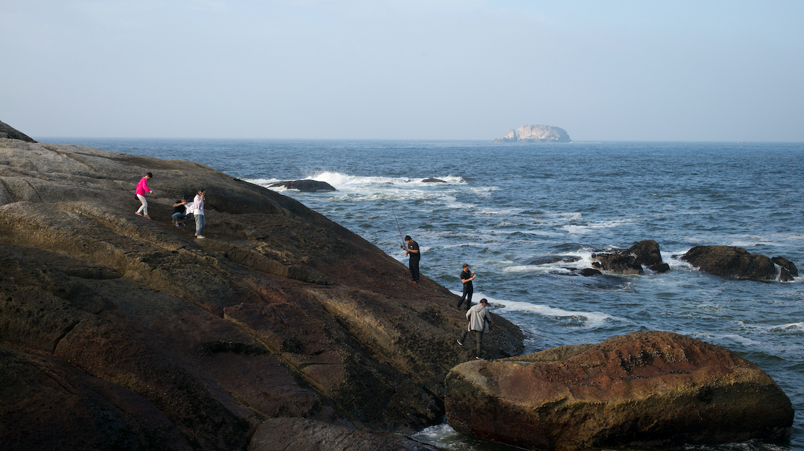

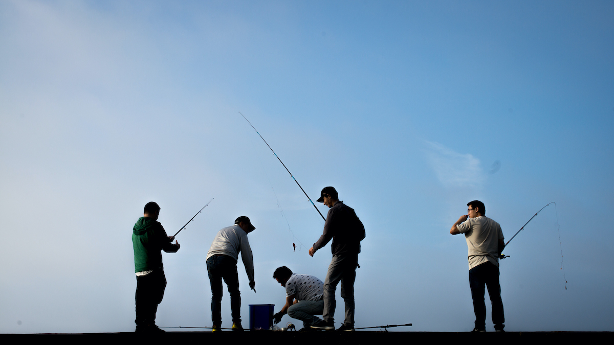

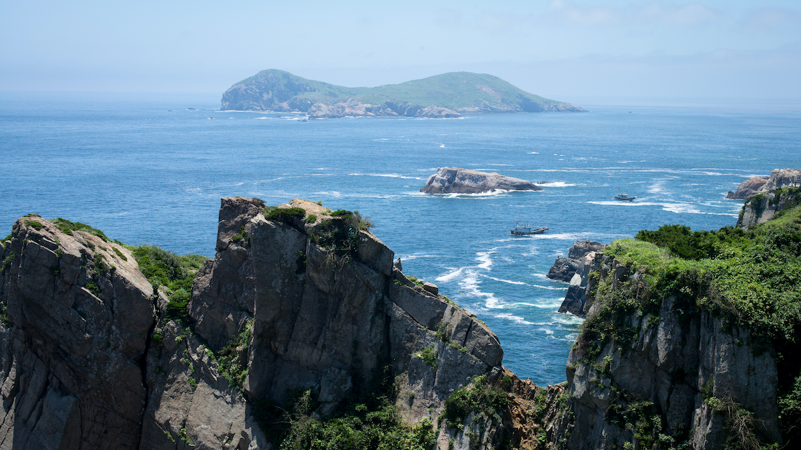

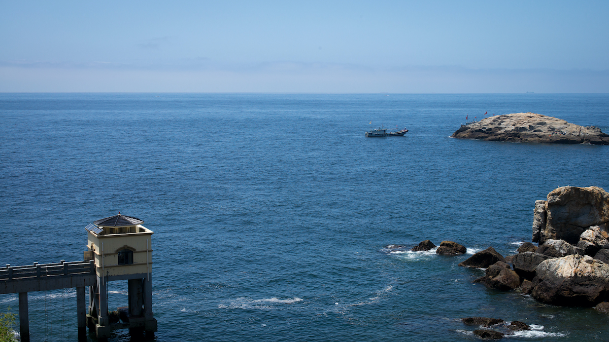

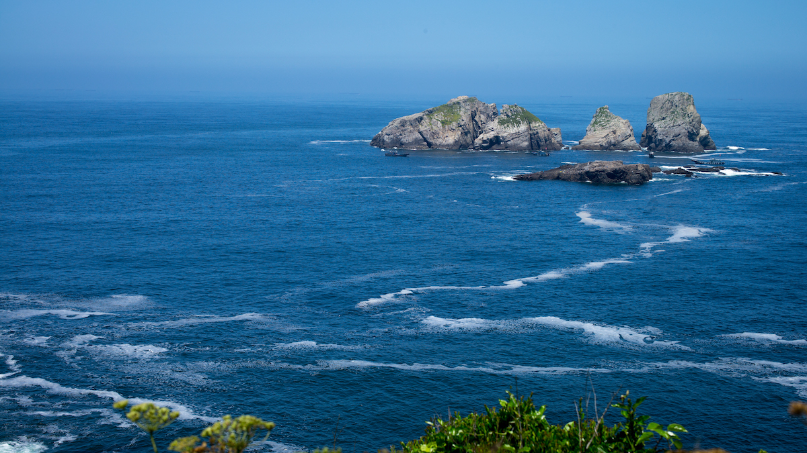

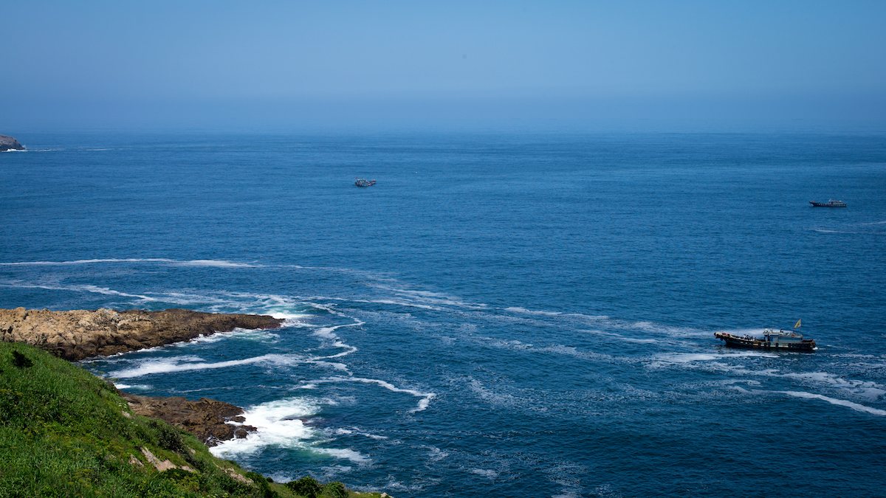

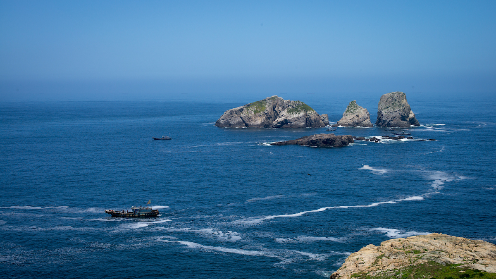

---

##交通Tips
###石浦 - 渔山岛

慢船：象浓度13号，到达渔山2个半小时，满载70人，票价来回220/人，单程110/人

快船：渔光曲3号 ，到达渔山80分钟，满载98人，票价来回316/人，单程158/人

---