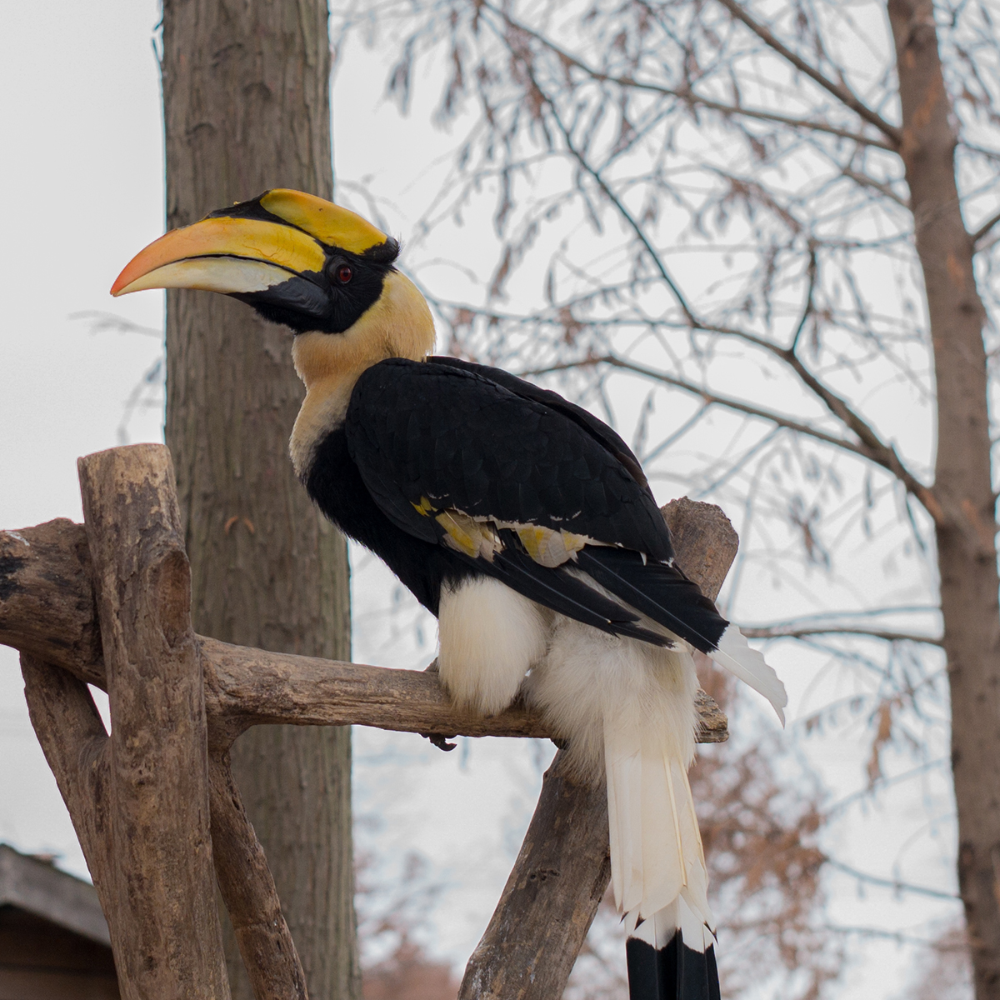
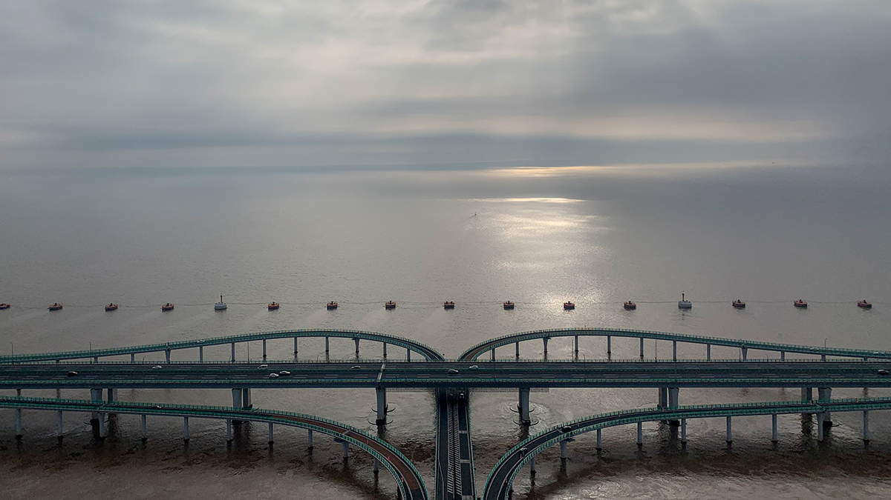

辛丑年大年初二，因疫情无法去外地旅游，只能在附近游玩。早上9时许，我们驱车去往杭州湾国家湿地公园。距上次去杭州湾湿地公园已有6-7年了，故地重游，想看看冬季的湿地公园是一番什么景色。

据湿地公园官网介绍，杭州湾国家湿地公园位于杭州湾跨海大桥西侧，总面积63.8平方公里，区域属于中国八大盐碱湿地之一庵东滩涂，是世界级观鸟胜地。湿地鸟类资源丰富，是候鸟从西伯利亚迁徙至澳大利亚的重要中转站，目前已记录鸟类220余种，隶属于18目45科，包括近危鸟种青头潜鸭、罗纹鸭、黑尾塍鹬、白腰杓鹬、大杓鹬和震旦鸦雀，脆弱鸟种卷羽鹈鹕、遗鸥和黄胸鹀；还有被列入国家重点保护野生动物名录的普通鵟、红隼、环颈雉和小杓鹬。（杭州湾国家湿地公园官网：http://www.hzwsdzx.com ）

我们驱车一小时左右到达湿地公园，天气阴，气温不低，适宜户外走动。进入园区后，首先需搭乘渡船进入到里面。游客并不很多，以本地特别是慈溪的游客为主。

经过10分钟左右的渡船，我们来到园区里面。首先看到的是麋鹿区，一群麋鹿在水中争相探头吃游客投喂的树叶，还有一些在远处的土堆上悠闲地漫步。

看过麋鹿，徒步继续往园区内走去。阴沉的天气，黄色的植被，感觉就是冬季的萧条。如果有阳光和花草就更加漂亮了。园区较大，没有人群拥挤的感觉，我们摘了口罩，呼吸着新鲜的空气。

湿地现有一些天鹅在此过冬，有白天鹅、黑天鹅、黑颈天鹤等。

继续往园区里走，看到了一池的鹈鹕，在水中争食。

旁边是一个小园子，里面有不知名的鸟，又长又大的鸟喙，金黄色的冠，吸引很多孩子的关注。

湿地公园还有很多动物，包括羊驼、环尾猴等，最后参观了候鸟博物馆。等春夏季节，再来湿地公园，应该能看到更多的花草和鸟类。

从湿地公园出来，我们上高速去了杭州湾大桥中间的海天一洲观景台。因天气阴阴的，远处的海天已经混为一体，看不到海平面，只有朦胧的雾气一片。

---

##交通Tips

自驾从沈海高速的庵东出口下，按路标行驶10分钟左右就到。

---