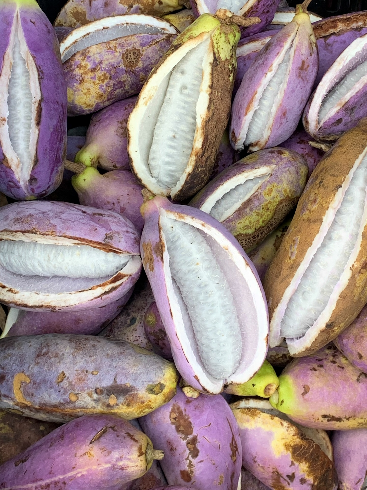

国庆假期，没有到很远的地方去旅行，驾车来到东钱湖畔的韩岭老街，这是老街改造后第一次来游玩。老街不大，不到2个小时就走完了。国庆假期到东钱湖的自驾车挺多的，路上堵了一小段。幸好我们是一早出发，不到中午就返程了，错峰出行，在老街上游玩的人还不算多，等我们出来，人才陆续多起来，地下停车场也停满了。

韩岭老街位于浙江省宁波市鄞州区东钱湖镇韩岭村，属于东钱湖风景区，距宁波市区约20公里，三面环山，一面临湖，山水相依。韩岭村历史源远流长，据传早年有韩姓居此而得名。唐天宝三年（公元744年）东钱湖疏浚后已有居民。北宋庆历八年（公元1048年），王安石治鄞时重建湖界，韩岭村已形成逢五、逢十的定期集市。南宋丞相史浩（公元1140年）经韩岭去祖居下水村时，留下《东湖游山》一书中就有“中有村，号韩岭，渔歌樵斧声相参”之句，足见韩岭集市在当时已小有名气。此后的几百年里，韩岭曾是宁波市区连接象山港的重要交通枢纽和水陆转运中心。（百度百科）

国庆快乐！

---

##交通Tips

自驾导航到 韩岭老街，有地下停车场

---