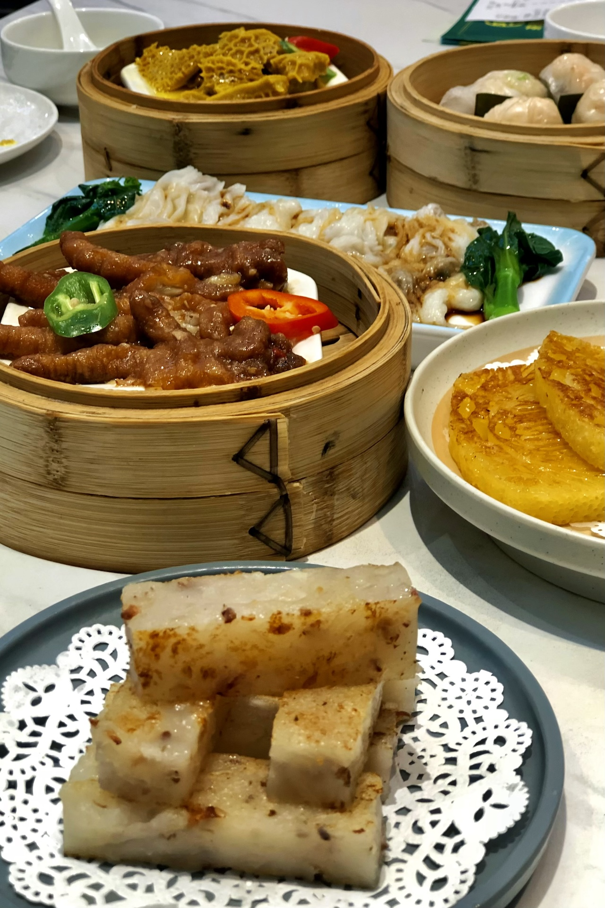
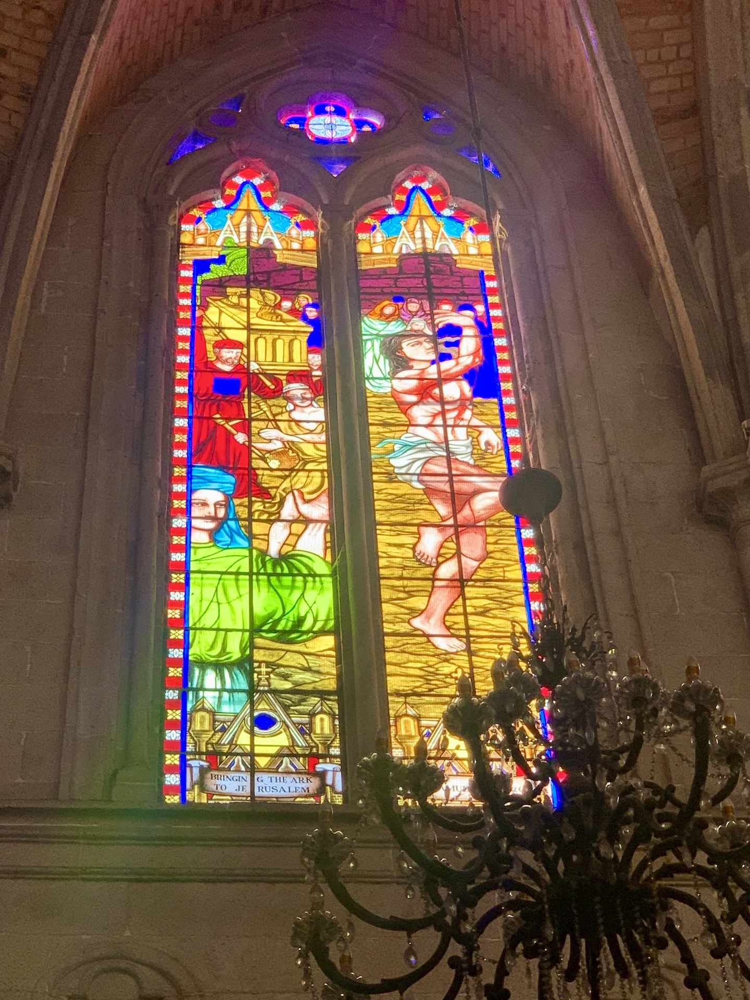
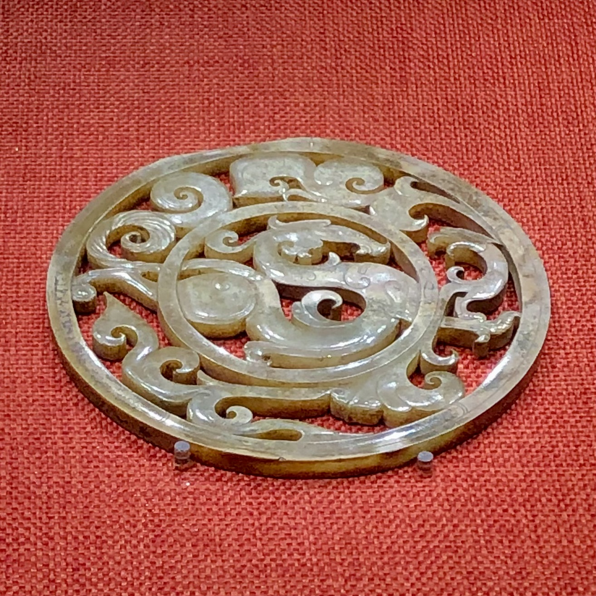

2024甲辰年春节，来到广州避寒，领略冬季的岭南风貌。广州又称羊城、花城等。我们到达广州的正月初二，气温15度左右，随后几天上升到25度，街头随处可见各种鲜花盛开，不愧花城的称号。

<h2>D1 夜游海心沙<h2>
飞机着陆广州是下午3点多，到市区已经5点了，路上的阳光还很晃眼。安顿好后，就出发去吃饭。第一餐当然选择当地菜，吃了烤乳鸭、烧鹅等特色粤菜。吃完后天色已逐渐暗下来，去看著名的小蛮腰夜景。

地铁到广州塔站后，随着人潮走出站，塔下周围全是人，随着人流慢慢往前走。因为预约了晚上8点-9点的海心桥，眼看时间已经8点多了，就抓紧往前走。因临时交通管制，需步行到前面路口掉头往回走，多了好多路，最终在晚上8:50赶到海心桥入口，顺利扫码进入。

海心桥和对岸的海心沙是观赏小蛮腰的最好位置，因为需要预约，桥上人不太多，可以悠闲地欣赏小蛮腰和珠江的夜景。

<h2>D2 长隆野生动物园<h2>
来广州还是要去一趟长隆的，去看看春节动物们都过得好不好。早上9点出门，到野生动物园排队入园已经是10点多了。园内人非常多，特别是熊猫馆，就是人贴人往前走，而且熊猫大多在睡觉。

在野生动物园走了大半天，看了各种动物，坐了缆车。小火车排队需要2小时，就放弃了。下次不能在节假日来了，人实在太多。那天共走了27000多步，创本人记录了。

<h2>D3 陈家祠 - 圣心大教堂 - 永庆坊<h2>
睡到自然醒，到酒店附近的“又一间茶楼”吃早茶，感受粤式早茶文化。喝茶聊天吃东西，吃完快中午了。

吃完饭打车去圣心大教堂，到了才知道中午是不开门的，要等13:00开门。于是决定先去陈家祠。陈家祠建于清光绪年间，里面的雕梁画栋、木雕窗扇、各种工艺品令人赞叹。

从陈家祠出来已3点多，直奔省心大教堂。教堂前又是人挤人，排队分批进入教堂。等了10多分钟，排队进入，里面也全是人，稍微拍了几张照片，就出来了。

接下去就去永庆坊，到那边已经天色将暗，参观了粤剧博物馆、粤绣、醒狮工艺等，就打道回府，去找一家粤菜饭店品尝美食。

<h2>D4 南越王博物馆（王墓展区） - 越秀公园花灯 - 北京路步行街夜游<h2>
上午参观南越王博物馆（王墓展区），幸亏在出发去广州前已经预约购票，当天和接下去几天的票已经全部售磬。

参观完博物馆已是中午，午餐吃了一家潮汕牛肉火锅，回酒店休息。傍晚出发，去越秀公园看花灯展。

从越秀公园出来，前往北京路步行街，随便逛逛，看到大佛寺被灯光照得金碧辉煌。

<h2>D5 云台花园<h2>
第五天行程比较轻松，上午去云台花园观赏郁金香展。温暖的阳光，漂亮的鲜花，新鲜的空气，令人驻足流连。回程前的最后一站，又一次让我感受到花城的美丽。

---

##交通Tips

飞机到白云国际机场

---